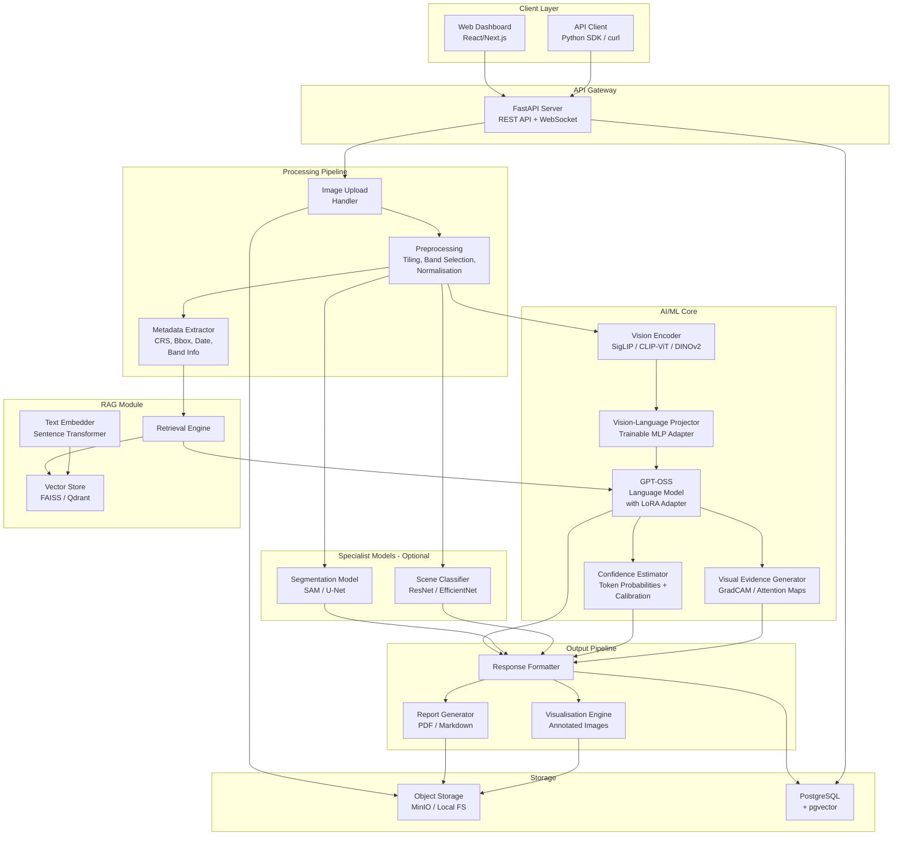
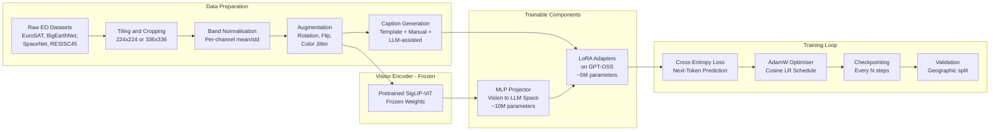
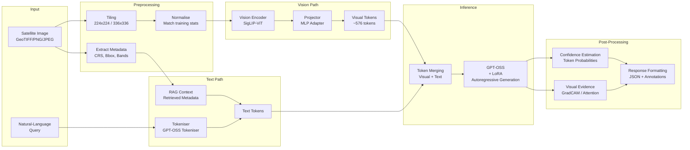
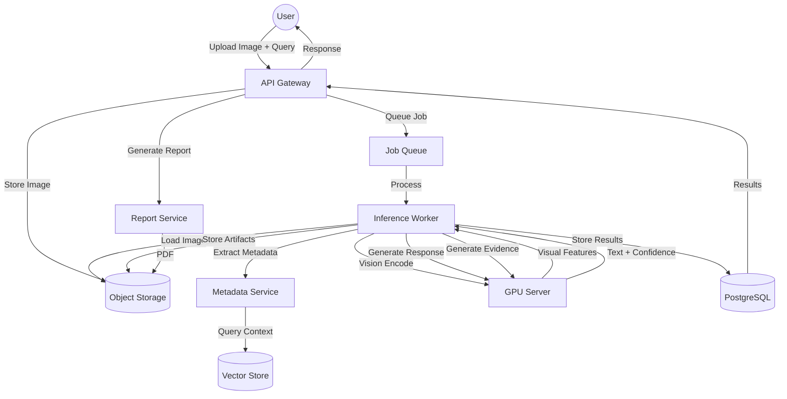
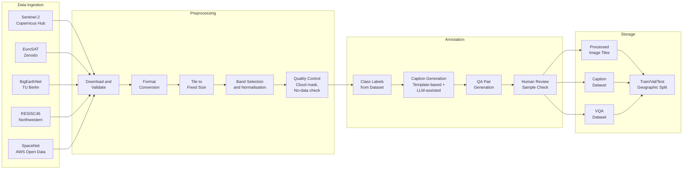
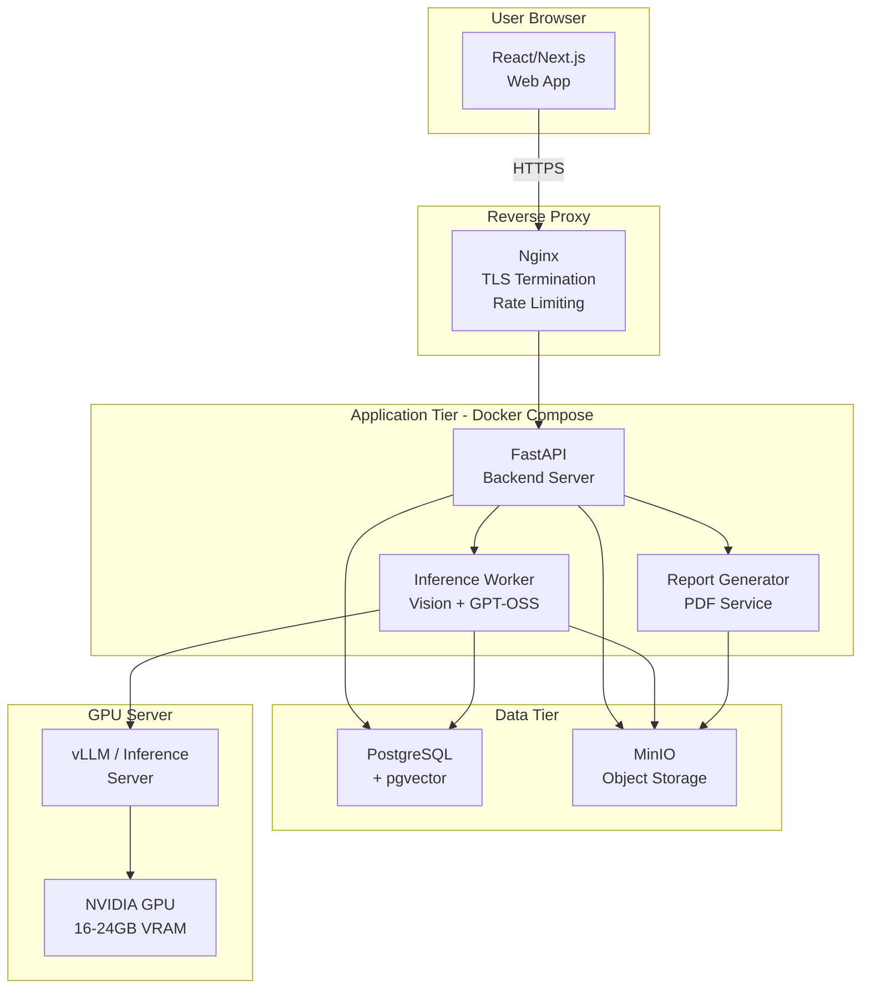

# Product Requirements Document

## Enhancing OpenAI's GPT-OSS with Multimodal Vision Capabilities Extensible to ISRO Earth Observation Data

| Field | Value |
|---|---|
| **Document Version** | 1.0 |
| **Date** | 2025-XX-XX (to be finalised at submission) |
| **Event** | Smart India Hackathon 2025 |
| **Problem Provider** | Indian Space Research Organisation (ISRO) |
| **Document Type** | Product Requirements Document (PRD) |
| **Classification** | Public / Non-Confidential |
| **Prepared by** | [Team Name — to be filled] |

> [!IMPORTANT]
> **Disclaimer**: This document does not claim any official endorsement by ISRO. All references to ISRO datasets are limited to publicly accessible and appropriately licensed sources. Proposed accuracy targets are aspirational estimates, not guaranteed benchmarks.

---

# 1. Executive Summary

This PRD describes a multimodal AI system that extends the open-source GPT-OSS language model with vision capabilities tailored for Earth Observation (EO) data analysis. The system connects a pretrained vision encoder to GPT-OSS through a trainable vision-language adapter, enabling the model to understand, analyse, and reason over satellite imagery, answer natural-language questions about EO scenes, generate structured reports, and provide visual evidence for its interpretations.

**Core capability**: Given a satellite image and a natural-language query, the system produces a grounded textual response with confidence estimates, visual evidence (heatmaps, bounding boxes), and an optional downloadable report.

**Target audience**: Remote-sensing scientists, disaster-management officers, agriculture analysts, urban planners, students, and general users without deep geospatial expertise.

**Key differentiators**:
- Multimodal reasoning over satellite imagery, not just natural photographs
- Designed for Indian EO use cases (flood assessment, crop monitoring, urban expansion)
- Explainable outputs with confidence estimation and visual evidence
- Extensible to ISRO satellite data (e.g., Resourcesat, Cartosat, INSAT/3D) when access permits
- Privacy-preserving — sensitive imagery never leaves the deployment environment

**MVP scope**: A working prototype that accepts an EO image tile and a natural-language question, produces a captioned analysis with confidence scores and visual evidence, and generates a downloadable report. The MVP will demonstrate at least three realistic EO use cases: flood/disaster assessment, agricultural monitoring, and land-use classification.

**Architecture**: A hybrid approach combining (A) a vision encoder with a trainable projector feeding into GPT-OSS for core visual reasoning, (C) Retrieval-Augmented Generation for geospatial metadata enrichment, and (D) optional external specialist models for tasks like segmentation. This provides the best balance of capability, development speed, and computational feasibility for a hackathon team.

**Estimated computational requirement (MVP)**: A single GPU with 16–24 GB VRAM (e.g., NVIDIA T4/A10/RTX 3090) is sufficient for inference and adapter fine-tuning with LoRA/QLoRA.

---

# 2. Problem Statement

Earth Observation data from satellites generates terabytes of imagery daily. Analysts must manually inspect images, cross-reference metadata, apply domain-specific heuristics, and write reports — a process that is slow, inconsistent, and inaccessible to non-specialists.

Current large language models (LLMs) excel at text-based reasoning but cannot natively process satellite imagery. Current vision-language models (VLMs) are trained predominantly on natural photographs and perform poorly on overhead/nadir satellite scenes, multispectral imagery, and domain-specific EO queries.

**The gap**: No open-source, locally deployable system exists that combines strong language reasoning (GPT-OSS) with satellite-image understanding to provide explainable, query-driven EO analysis with Indian use-case specialisation.

**The need**: Extend GPT-OSS with a vision encoder and alignment layer so that it can:
1. Accept satellite imagery (RGB and multispectral where feasible)
2. Understand spatial patterns, land-cover types, anomalies, and temporal changes
3. Answer natural-language questions about the imagery
4. Produce structured reports with confidence estimates
5. Support ISRO EO data when publicly accessible datasets are available
6. Remain open-source, reproducible, and privacy-preserving

----

# 3. Background and Motivation

## 3.1 India's Earth Observation Ecosystem

India operates one of the largest civilian remote-sensing satellite constellations globally. ISRO's satellites — including the Resourcesat, Cartosat, Oceansat, and INSAT/3D series — generate vast volumes of EO data used for agriculture, disaster management, urban planning, forestry, water resources, and defence. The Bhoonidhi geoportal provides access to certain ISRO datasets, though access policies and licensing vary by product.

## 3.2 The Analysis Bottleneck

Despite abundant data, EO analysis remains expert-dependent. A remote-sensing scientist must:
- Select and download appropriate satellite scenes
- Preprocess imagery (radiometric correction, atmospheric correction, orthorectification)
- Apply classification or change-detection algorithms
- Manually interpret results
- Write narrative reports for decision-makers

This process can take hours to days per scene. Non-specialists (e.g., district magistrates during disasters) cannot perform this independently.

## 3.3 The Multimodal AI Opportunity

Recent advances in vision-language models (LLaVA, InternVL, Qwen-VL) have demonstrated that a pretrained vision encoder can be connected to an LLM through a lightweight projection layer, enabling the LLM to "see" and reason about images. However, these models are trained on web-crawled natural images and fail on:
- Overhead/nadir perspective of satellite imagery
- Multispectral bands beyond RGB (NIR, SWIR, thermal)
- Domain-specific EO terminology and analysis patterns
- Indian geographic and agricultural contexts

## 3.4 Why GPT-OSS?

GPT-OSS is specified as the primary language-reasoning backbone per the problem statement. It provides:
- Strong instruction-following and reasoning capabilities
- Open-source availability for local deployment
- Extensibility through adapter/projector training
- No dependency on proprietary cloud inference during deployment

## 3.5 Hackathon Context

Smart India Hackathon is India's largest open-innovation platform. The solution must be:
- Demonstrable within a hackathon timeline (36–72 hours of focused development, with prior preparation)
- Practical — not a research paper but a working prototype
- Impactful for Indian use cases
- Technically sound but not overengineered

---

# 4. Product Vision

**Enable any user — from a remote-sensing expert to a district official — to upload a satellite image, ask a natural-language question, and receive a grounded, explainable, confidence-rated analysis with supporting visual evidence and a downloadable report, powered by an open-source multimodal AI system that keeps data private and runs locally.**

---

# 5. Product Goals

| ID | Goal | Measurable Target | Timeframe |
|---|---|---|---|
| G1 | Extend GPT-OSS with satellite-image understanding | System accepts EO images and produces relevant textual analysis | MVP |
| G2 | Support Visual Question Answering over EO data | System answers natural-language queries about satellite images | MVP |
| G3 | Provide explainable outputs | Responses include confidence estimates and visual evidence | MVP |
| G4 | Generate structured reports | Downloadable text/PDF reports from analysis sessions | MVP |
| G5 | Demonstrate Indian EO use cases | At least 3 realistic scenarios (disaster, agriculture, land-use) | MVP |
| G6 | Maintain open-source, local deployability | System runs without proprietary cloud API calls during inference | MVP |
| G7 | Support multispectral imagery | System handles NIR, SWIR, and thermal bands where feasible | Post-MVP |
| G8 | Integrate ISRO-specific datasets | System processes Resourcesat, Cartosat imagery when accessible | Post-MVP |
| G9 | Enable temporal/change analysis | Compare multi-date imagery for change detection | Post-MVP |
| G10 | Achieve production-grade reliability | 99.5% uptime, <5s response latency for standard queries | Post-MVP |

---

# 6. Non-Goals

| ID | Non-Goal | Rationale |
|---|---|---|
| NG1 | Replace professional GIS software | The system augments, not replaces, expert workflows |
| NG2 | Real-time satellite data ingestion | Real-time processing requires infrastructure beyond hackathon scope |
| NG3 | Process full-resolution raw satellite scenes (>10 GB) end-to-end | MVP focuses on preprocessed image tiles |
| NG4 | Train a foundation model from scratch | We use pretrained vision encoders and LLMs |
| NG5 | Provide legally binding analysis (e.g., for insurance claims) | Outputs require human expert verification |
| NG6 | Access or process classified/restricted ISRO data | Only publicly available, appropriately licensed data is used |
| NG7 | Mobile-native application | Web-based interface is sufficient for hackathon demonstration |
| NG8 | Multi-language interface | English-only for MVP; Hindi/regional language support is post-MVP |
| NG9 | Claim official ISRO endorsement | The project is an independent contribution to SIH |
| NG10 | Guarantee specific accuracy percentages | All metrics are proposed targets, subject to validation |

---

# 7. Target Users and Personas

## 7.1 Remote-Sensing Scientist (Dr. Priya Sharma)

| Attribute | Detail |
|---|---|
| Role | Senior Scientist, ISRO/SAC or academic lab |
| Age | 35–50 |
| Technical skill | Expert in GIS, remote sensing, image processing |
| Pain points | Spends hours writing manual analysis reports; needs faster interpretation |
| Needs | Accurate analysis, multispectral support, confidence scores, reproducibility |
| Usage | Uploads preprocessed imagery, asks technical questions, validates outputs |
| Success metric | Reduces report-writing time by ≥50% |

## 7.2 Disaster-Management Officer (Rajesh Kumar, IAS)

| Attribute | Detail |
|---|---|
| Role | District Magistrate / NDMA Officer |
| Age | 40–55 |
| Technical skill | Limited GIS knowledge; comfortable with web interfaces |
| Pain points | During disasters, needs rapid situational awareness; cannot wait for expert analysis |
| Needs | Simple upload → question → answer workflow; actionable summaries |
| Usage | Uploads flood/cyclone imagery, asks "What areas are flooded?" |
| Success metric | Receives actionable assessment within 2 minutes of upload |

## 7.3 Agriculture Analyst (Meena Devi)

| Attribute | Detail |
|---|---|
| Role | Agriculture Extension Officer, State Government |
| Age | 30–45 |
| Technical skill | Basic computer literacy; familiar with crop patterns but not RS tools |
| Pain points | Crop health assessment requires specialist tools she lacks |
| Needs | Upload crop imagery, get health assessment, stress indicators |
| Usage | Seasonal crop monitoring, drought assessment |
| Success metric | Identifies crop stress regions without GIS training |

## 7.4 Urban-Planning Analyst (Arjun Mehta)

| Attribute | Detail |
|---|---|
| Role | Town Planner, Smart Cities Mission |
| Age | 28–40 |
| Technical skill | Moderate; uses GIS occasionally |
| Pain points | Urban sprawl analysis requires multi-temporal comparison and expert interpretation |
| Needs | Land-use classification, change detection, structured reports for policy briefs |
| Usage | Quarterly urban expansion monitoring |
| Success metric | Generates urban growth report without manual classification |

## 7.5 Student / Researcher (Ananya Reddy)

| Attribute | Detail |
|---|---|
| Role | M.Tech student in Remote Sensing |
| Age | 22–26 |
| Technical skill | Strong programming; learning RS domain |
| Pain points | High learning curve for EO analysis; limited computational resources |
| Needs | Interactive exploration of satellite imagery; learns domain through AI explanations |
| Usage | Research exploration, dataset annotation, learning tool |
| Success metric | Accelerates literature-to-experiment cycle; uses system for thesis work |

## 7.6 General User with Limited Geospatial Expertise (Vikram Singh)

| Attribute | Detail |
|---|---|
| Role | Journalist / NGO Worker / Citizen Scientist |
| Age | 25–50 |
| Technical skill | Basic; uses standard web applications |
| Pain points | Cannot interpret satellite imagery; needs plain-language explanations |
| Needs | Upload an image, ask simple questions, get understandable answers |
| Usage | Fact-checking environmental claims; community-level monitoring |
| Success metric | Understands EO analysis output without domain training |

---

# 8. User Pain Points

| ID | Pain Point | Affected Personas | Severity |
|---|---|---|---|
| PP1 | EO analysis requires expensive proprietary software (ERDAS, ENVI, ArcGIS Pro) | All except RS Scientist | High |
| PP2 | Manual image interpretation is slow (hours per scene) | RS Scientist, DM Officer | High |
| PP3 | Non-specialists cannot interpret satellite imagery independently | DM Officer, Ag Analyst, General User | Critical |
| PP4 | Report generation is manual and time-consuming | RS Scientist, Urban Planner | High |
| PP5 | Multispectral data requires specialised knowledge to exploit | All except RS Scientist | High |
| PP6 | No natural-language interface exists for EO analysis | All | High |
| PP7 | Cloud-based AI tools raise data-sovereignty concerns for government imagery | DM Officer, RS Scientist | Medium |
| PP8 | Limited computational resources for students/researchers | Student/Researcher | Medium |
| PP9 | Existing AI models fail on Indian landscapes and crop types | Ag Analyst, RS Scientist | Medium |
| PP10 | No explainability — AI models give answers but not reasoning | All | High |

---

# 9. User Stories

| ID | Story | Priority | Acceptance Criteria |
|---|---|---|---|
| US1 | As a DM officer, I want to upload a satellite image of a flood-affected area and ask "What areas appear flooded?" so that I can prioritise rescue operations. | P0 | System identifies likely flooded regions, provides confidence %, shows visual overlay, and generates a summary within 60 seconds. |
| US2 | As an RS scientist, I want to ask the system to describe land-cover types in an image so that I can validate my classification results. | P0 | System produces a land-cover description consistent with standard RS categories (built-up, vegetation, water, barren, agriculture). |
| US3 | As an agriculture analyst, I want to upload crop imagery and ask "Does this crop appear healthy or stressed?" so that I can alert farmers. | P0 | System provides a health assessment with caveats about spectral limitations and recommends field verification. |
| US4 | As an urban planner, I want to compare two images and ask "How has built-up area changed?" so that I can measure urban expansion. | P1 | System describes apparent changes with caveats about temporal/sensor differences. |
| US5 | As a student, I want to ask open-ended questions about an EO scene to learn about interpretation techniques. | P1 | System provides educational explanations with references to EO concepts. |
| US6 | As a general user, I want to get a plain-language summary of a satellite image without needing domain knowledge. | P0 | System produces a non-technical summary accessible to non-specialists. |
| US7 | As any user, I want to download a PDF report of my analysis session. | P0 | System generates a structured PDF with images, annotations, and text. |
| US8 | As an RS scientist, I want confidence scores so that I know when to trust the AI and when to verify manually. | P0 | All responses include confidence indicators and "requires verification" flags. |
| US9 | As an RS scientist, I want to query multispectral imagery including NIR bands for vegetation analysis. | P1 | System accepts multi-band input and explains band-specific observations. |
| US10 | As a DM officer, I want the system to flag "insufficient evidence" rather than guessing. | P0 | System explicitly states uncertainty when visual evidence is ambiguous. |

---

# 10. Key Use Cases

## UC1: Flood / Disaster Assessment
- **Trigger**: DM officer uploads post-flood satellite image
- **Input**: RGB/false-colour composite image, query ("What areas are flooded?")
- **Processing**: Vision encoder extracts features → projector aligns to GPT-OSS → GPT-OSS reasons about water-body extent, unusual inundation, infrastructure proximity
- **Output**: Textual description of likely flooded areas, confidence map, annotated image, downloadable report
- **Constraints**: System must not claim precise flood depth or casualty estimates

## UC2: Agricultural Crop Monitoring
- **Trigger**: Agriculture analyst uploads seasonal crop imagery
- **Input**: Crop-area image (RGB or NDVI composite), query ("Is the crop healthy?")
- **Processing**: Vision encoder identifies vegetation patterns → GPT-OSS interprets greenness, uniformity, stress indicators
- **Output**: Health assessment with caveats, visual highlighting of stress regions, recommendation for field verification
- **Constraints**: System must not claim specific crop species unless confidence is high; must recommend ground truthing

## UC3: Urban Expansion / Land-Use Analysis
- **Trigger**: Urban planner uploads images from two time periods
- **Input**: Two image tiles of the same area, query ("How has the built-up area changed?")
- **Processing**: Vision encoder processes both images → GPT-OSS compares features and describes changes
- **Output**: Change narrative, highlighted change regions, area estimates with uncertainty bounds
- **Constraints**: System must caveat that precise area measurements require GIS-calibrated analysis

## UC4: Environmental Monitoring
- **Trigger**: Researcher uploads imagery of a water body or forest
- **Input**: Image tile, query ("Is there evidence of deforestation or water-body shrinkage?")
- **Processing**: Feature extraction → pattern interpretation → comparison with expected baselines
- **Output**: Environmental assessment with uncertainty, visual evidence
- **Constraints**: System must not make legal environmental-impact claims

## UC5: General EO Scene Description
- **Trigger**: Any user uploads a satellite image
- **Input**: Image tile, query ("Describe this image")
- **Processing**: Vision encoder → GPT-OSS generates comprehensive scene description
- **Output**: Natural-language caption covering land-cover types, notable features, spatial patterns
- **Constraints**: Description must be factual and grounded in visible features

---

# 11. Detailed Functional Requirements

| ID | Requirement | Priority | MVP/Future |
|---|---|---|---|
| FR1 | System shall accept satellite image uploads in GeoTIFF, TIFF, PNG, and JPEG formats | P0 | MVP |
| FR2 | System shall accept natural-language queries as free-text input | P0 | MVP |
| FR3 | System shall produce textual analysis of uploaded images | P0 | MVP |
| FR4 | System shall provide confidence estimates (e.g., low/medium/high or 0–100%) for each claim | P0 | MVP |
| FR5 | System shall generate visual evidence overlays (heatmaps, bounding boxes, highlighted regions) | P0 | MVP |
| FR6 | System shall generate downloadable text/PDF reports | P0 | MVP |
| FR7 | System shall support image tiling for large images (automatic splitting into analysable tiles) | P0 | MVP |
| FR8 | System shall extract and display GeoTIFF metadata (CRS, bounding box, acquisition date) | P1 | MVP |
| FR9 | System shall support multi-turn conversational analysis (follow-up questions) | P1 | MVP |
| FR10 | System shall flag "insufficient evidence" when confidence is below threshold | P0 | MVP |
| FR11 | System shall support multispectral imagery (≥4 bands) with band selection/compositing | P1 | Future |
| FR12 | System shall support temporal comparison (two images of same area, different dates) | P1 | Future |
| FR13 | System shall retrieve and incorporate geospatial metadata via RAG | P1 | MVP (basic) |
| FR14 | System shall provide an interactive map view showing image footprint | P2 | Future |
| FR15 | System shall support batch analysis of multiple tiles | P2 | Future |
| FR16 | System shall log all analyses for audit and reproducibility | P1 | MVP |
| FR17 | System shall support user authentication and session management | P1 | MVP (basic) |
| FR18 | System shall provide a REST API for programmatic access | P0 | MVP |
| FR19 | System shall render analysis results in a web-based dashboard | P0 | MVP |
| FR20 | System shall provide model-information endpoint (version, training data, capabilities) | P1 | MVP |

---

# 12. Detailed Non-Functional Requirements

| ID | Requirement | Target | Priority |
|---|---|---|---|
| NFR1 | Response latency for a single-tile analysis | <30 seconds (MVP), <10 seconds (production) | P0 |
| NFR2 | Concurrent users supported | ≥5 simultaneous (MVP), ≥50 (production) | P1 |
| NFR3 | System availability | 95% (MVP demo), 99.5% (production) | P1 |
| NFR4 | Maximum image upload size | 100 MB per image (MVP) | P0 |
| NFR5 | Data privacy | All processing local; no data sent to external APIs during inference | P0 |
| NFR6 | Model reproducibility | All training scripts, configs, and seeds documented; re-training produces comparable results | P1 |
| NFR7 | Containerised deployment | Full system deployable via Docker Compose | P0 |
| NFR8 | GPU memory footprint (inference) | ≤16 GB VRAM for quantised model | P0 |
| NFR9 | API response format | JSON with standardised error codes and messages | P0 |
| NFR10 | Logging and observability | Structured JSON logs; basic health-check endpoint | P1 |
| NFR11 | Browser compatibility | Chrome, Firefox, Edge (latest 2 versions) | P0 |
| NFR12 | Accessibility | WCAG 2.1 AA compliance for web interface | P2 |

---

# 13. MVP Scope for a Hackathon

The Minimum Viable Product must demonstrate a complete end-to-end workflow:

```
[User uploads EO image] → [System preprocesses and tiles] → [Vision encoder extracts features]
→ [Projector aligns features to LLM space] → [GPT-OSS generates analysis] → [Confidence estimation]
→ [Visual evidence overlay] → [Report generation] → [User views results in web UI]
```

### MVP Feature Set

| # | Feature | Description | Included |
|---|---|---|---|
| 1 | Image upload | Accept GeoTIFF, PNG, JPEG satellite image tiles | ✅ |
| 2 | Natural-language query | Free-text question input | ✅ |
| 3 | Image analysis | Captioning + VQA using vision encoder + GPT-OSS | ✅ |
| 4 | Confidence estimation | Low/Medium/High confidence per claim | ✅ |
| 5 | Visual evidence | Heatmap or highlighted regions on the image | ✅ |
| 6 | Report generation | Downloadable text/PDF report | ✅ |
| 7 | 3 demo use cases | Flood assessment, crop monitoring, land-use classification | ✅ |
| 8 | Web dashboard | Simple React/Next.js frontend | ✅ |
| 9 | REST API | Core endpoints for upload, analyse, question, report | ✅ |
| 10 | Metadata extraction | Basic GeoTIFF metadata display | ✅ |
| 11 | RAG for context | Basic retrieval of location/band metadata | ✅ (basic) |
| 12 | Multi-turn conversation | Follow-up questions about same image | ⚠️ Stretch |
| 13 | Multispectral support | Full multi-band processing | ❌ Post-MVP |
| 14 | Temporal comparison | Two-date change detection | ❌ Post-MVP |
| 15 | Map visualisation | Interactive map with image footprint | ❌ Post-MVP |

---

# 14. Future Scope Beyond the MVP

| Feature | Description | Value | Complexity |
|---|---|---|---|
| Full multispectral support | Process 10+ bands (Sentinel-2, Resourcesat LISS-IV) | High | High |
| Temporal change detection | Automated two-date comparison with change maps | High | Medium |
| ISRO data connector | Direct integration with Bhoonidhi API when accessible | High | Medium |
| Interactive map | Leaflet/OpenLayers map overlay with analysis footprints | Medium | Medium |
| Fine-tuning on Indian EO data | Domain adaptation using Indian landscape imagery | High | High |
| Segmentation model integration | SAM or U-Net for precise boundary delineation | High | Medium |
| Hindi/regional language support | Multilingual queries and reports | Medium | Medium |
| Automated monitoring pipelines | Scheduled analysis of new acquisitions | High | High |
| Mobile-responsive UI | Tablet/phone-friendly interface for field use | Medium | Medium |
| Collaborative analysis | Multi-user project sharing and annotation | Medium | Medium |
| Edge deployment | Lightweight model for disconnected field operations | High | High |
| STAC catalog integration | Standard EO metadata interoperability | Medium | Low |

---

# 15. Proposed System Architecture

## 15.1 Architecture Approaches: Analysis and Comparison

### Approach A: Vision Encoder + Projector/Adapter + GPT-OSS

**Description**: A pretrained vision encoder (e.g., SigLIP, CLIP-ViT, DINOv2) extracts visual features from the satellite image. A trainable projection layer (linear or MLP) maps these visual features into the token embedding space of GPT-OSS. The combined visual + text tokens are fed to GPT-OSS for language generation.

| Aspect | Assessment |
|---|---|
| Accuracy | High for scene-level understanding; depends on vision encoder quality |
| Training cost | Low — only projector/adapter is trained (few million parameters) |
| Inference speed | Single forward pass; fast |
| Hackathon feasibility | High — well-documented pattern (LLaVA architecture) |
| Limitation | Vision encoder may lack EO domain knowledge |

### Approach B: Vision-Language Model Fine-Tuning

**Description**: Fine-tune an existing VLM (e.g., LLaVA, InternVL) end-to-end or with LoRA on EO data.

| Aspect | Assessment |
|---|---|
| Accuracy | Potentially highest if sufficient EO training data available |
| Training cost | High — requires substantial GPU compute and EO training data |
| Inference speed | Comparable to Approach A |
| Hackathon feasibility | Medium — time-constrained for data preparation and training |
| Limitation | May diverge from GPT-OSS as the primary backbone if using a different VLM |

### Approach C: Retrieval-Augmented Generation (RAG) over EO Metadata

**Description**: Index EO metadata, band descriptions, geographic context, and domain knowledge into a vector store. Retrieve relevant context before sending the query to GPT-OSS. The LLM reasons over retrieved text + any image description.

| Aspect | Assessment |
|---|---|
| Accuracy | Good for metadata-enriched answers; weak for pixel-level visual understanding |
| Training cost | None (retrieval only) |
| Inference speed | Adds retrieval latency (~100–500ms) |
| Hackathon feasibility | Very high — no training required |
| Limitation | Cannot "see" the image directly; depends on pre-generated descriptions |

### Approach D: External Vision Model + GPT-OSS via API

**Description**: Use an external vision model (e.g., a classification or segmentation model) to generate structured outputs (labels, bounding boxes, segment maps). Feed these structured outputs as text context to GPT-OSS for reasoning and report generation.

| Aspect | Assessment |
|---|---|
| Accuracy | Good for tasks with trained specialist models; limited by model coverage |
| Training cost | Low if using pretrained specialist models |
| Inference speed | Multiple model calls; higher latency |
| Hackathon feasibility | High — modular, easy to swap components |
| Limitation | GPT-OSS never sees raw visual features; limited visual reasoning |

### Approach E: Hybrid Architecture (Recommended)

**Description**: Combine Approaches A, C, and D:
1. **Primary**: Vision encoder + projector + GPT-OSS (Approach A) for core visual reasoning
2. **Augmentation**: RAG over EO metadata (Approach C) for contextual enrichment
3. **Specialist**: Optional external models (Approach D) for specific tasks (e.g., segmentation via SAM)

| Aspect | Assessment |
|---|---|
| Accuracy | Highest overall — visual reasoning + contextual knowledge + specialist capabilities |
| Training cost | Low — only projector/adapter trained; RAG requires indexing, not training |
| Inference speed | Moderate — primary vision-LLM path is fast; RAG adds small overhead |
| Hackathon feasibility | High — modular; team can implement primary path first, add RAG and specialists incrementally |
| Scalability | Each component can be improved independently |

### Recommendation

**Approach E (Hybrid)** is recommended for the hackathon MVP because:
1. The vision encoder + projector path (A) gives GPT-OSS genuine visual understanding with minimal training
2. RAG (C) adds domain context without training cost
3. External specialist models (D) handle specific subtasks (segmentation, classification) where pixel-level accuracy matters
4. The modular design allows the team to build incrementally — the core A path first, then layer in C and D
5. It satisfies the requirement that GPT-OSS remains the primary language-reasoning model

## 15.2 High-Level System Architecture



---

# 16. AI/ML Architecture

## 16.1 Training Pipeline



## 16.2 Inference Pipeline



## 16.3 Data Flow Diagram



---

# 17. Data Pipeline



---

# 18. Dataset Strategy

## 18.1 Recommended Public Datasets

| Dataset | Type | Size (approx.) | Resolution | Bands | Labels | Licence | Use in Project |
|---|---|---|---|---|---|---|---|
| **EuroSAT** | Scene classification | 27,000 images | 10m (Sentinel-2) | 13 bands | 10 land-use classes | MIT | Primary training for scene classification; well-structured, easy to use |
| **BigEarthNet** | Multi-label classification | 590,326 patches | 10–60m (Sentinel-2) | 12 bands | 43 CORINE classes | Community Data License Agreement – Permissive | Large-scale training; multi-label understanding |
| **RESISC45** | Scene classification | 31,500 images | Varies (0.2–30m) | RGB | 45 scene classes | Research use | Scene diversity; RGB-only but extensive class coverage |
| **SpaceNet** | Building/road segmentation | Varies by challenge | 0.3–0.5m | RGB + Pan | Building footprints, road networks | SpaceNet License (permissive for research) | Urban feature detection; segmentation training data |
| **xView** | Object detection | 1,400 km² | 0.3m | RGB | 60 object classes | DIUx xView License | Fine-grained object detection |
| **DIOR** | Object detection | 23,463 images | 0.5–30m | RGB | 20 object classes | Research use | Object detection in optical RS imagery |
| **Sentinel-2 L2A** | Raw imagery | Unlimited | 10–60m | 13 bands | None (unlabelled) | Copernicus Open Access | Custom tile creation for Indian geography; free and operationally available |
| **ISRO Bhoonidhi** | Various products | Varies | Varies | Varies | Varies | Per-product; check availability | Indian-specific imagery; use only if publicly accessible products are confirmed |

## 18.2 Why RGB Datasets Alone Are Insufficient

Standard RGB image datasets (e.g., ImageNet, COCO) are photographed from ground level with visible-light cameras. Satellite EO imagery differs fundamentally:

- **Perspective**: Nadir (straight down) vs. oblique/eye-level — scene geometry is completely different
- **Scale**: A single pixel may represent 10m × 10m of ground area
- **Spectral range**: EO sensors capture Near-Infrared (NIR), Short-Wave Infrared (SWIR), and thermal bands that reveal vegetation health, water content, soil moisture, and urban heat — invisible in RGB
- **Radiometry**: Pixel values represent calibrated reflectance or radiance, not perceptual colour
- **Temporal dimension**: The same location is revisited regularly; change detection is fundamental

**Implication**: A vision encoder trained only on RGB photographs will not understand NDVI (Normalised Difference Vegetation Index), false-colour composites, or band-ratio analyses that are standard in EO. For the MVP, we can work with RGB composites of satellite data and add multispectral support progressively.

## 18.3 Indian-Specific Data Considerations

| Source | Accessibility | Notes |
|---|---|---|
| ISRO Bhoonidhi | Requires registration; product-specific access policies | Do not assume open access; verify each product |
| ISRO MOSDAC | Meteorological data; some products freely available | Weather and ocean data; limited for land-use |
| Sentinel-2 over India | Free and open (Copernicus) | Best option for custom Indian tiles |
| LULC maps (NRSC) | Some published; access varies | Useful for validation, not training |
| Bhuvan portal | Limited programmatic access | Useful for visual reference; check terms of use |

**Recommendation for MVP**: Use EuroSAT + RESISC45 for scene classification training, SpaceNet for urban features, and download Sentinel-2 tiles over Indian cities/agricultural regions for demonstration. Do not depend on ISRO-specific data that requires approval.

---

# 19. Training and Fine-Tuning Strategy

## 19.1 Training Plan

### Phase 1: Vision-Language Alignment (Projector Training)

| Aspect | Detail |
|---|---|
| **Objective** | Train the MLP projector to map vision encoder features into GPT-OSS embedding space |
| **Data** | EuroSAT + RESISC45 images with template-generated captions (e.g., "This is a satellite image showing [class]. The scene contains [features].") |
| **Frozen** | Vision encoder (SigLIP/CLIP-ViT) + GPT-OSS |
| **Trainable** | MLP projector (~10M parameters) |
| **Compute** | ~2–4 hours on a single 16GB GPU |
| **Loss** | Cross-entropy (next-token prediction) |
| **Optimiser** | AdamW, lr=1e-3, cosine schedule |

### Phase 2: Instruction Tuning with LoRA

| Aspect | Detail |
|---|---|
| **Objective** | Fine-tune GPT-OSS (via LoRA) to follow EO-specific instructions and produce structured analyses |
| **Data** | Curated VQA pairs, structured analysis templates, multi-turn conversations about EO scenes |
| **Frozen** | Vision encoder |
| **Trainable** | Projector + LoRA adapters on GPT-OSS (~5–15M parameters, rank 16–64) |
| **Compute** | ~4–8 hours on a single 16–24GB GPU (estimate) |
| **Loss** | Cross-entropy (next-token prediction) |
| **Optimiser** | AdamW, lr=2e-5, cosine schedule |

### Phase 3: RAG Knowledge Base Construction (No Training)

| Aspect | Detail |
|---|---|
| **Objective** | Index EO domain knowledge, band descriptions, ISRO satellite specs, geographic context |
| **Data** | EO textbooks, ISRO documentation (public), Sentinel-2 band descriptions, land-use taxonomies |
| **Process** | Chunk documents → embed with sentence transformer → store in FAISS/pgvector |
| **Compute** | Minimal; CPU-only |

## 19.2 Data Preparation Details

- **Tiling**: Resize or tile all images to 224×224 or 336×336 pixels (matching vision encoder input)
- **Band normalisation**: Per-channel mean/std normalisation computed on the training set; for Sentinel-2, use published reflectance statistics
- **Augmentation**: Random horizontal/vertical flip, 90° rotation, minor color jitter (careful: preserve radiometric integrity); do NOT use aggressive colour augmentation that alters spectral relationships
- **Text labels**: Template-based caption generation from class labels; optionally LLM-assisted paraphrasing for diversity
- **Geographic split**: Ensure train/val/test sets have no spatial overlap; tiles from the same Sentinel-2 granule must be in the same split to prevent data leakage

## 19.3 Preventing Hallucinations

- Include "I cannot determine this from the image" responses in training data
- Add negative examples (images where the queried feature is absent)
- Train with uncertainty-aware prompts ("If uncertain, say so")
- Post-processing: calibrate confidence scores against validation-set accuracy
- Implement a confidence threshold below which the model outputs "Insufficient evidence for this claim"

## 19.4 Checkpointing and Reproducibility

- Save checkpoints every 500 steps
- Log all hyperparameters, random seeds, data splits, and git commit hashes
- Use deterministic training where possible (PyTorch `torch.use_deterministic_algorithms`)
- Document all training runs in an experiment log (see Appendix E)

## 19.5 Model Card

Produce a model card documenting:
- Model architecture, parameters, and training data
- Intended use cases and limitations
- Evaluation results on held-out data
- Known failure modes
- Ethical considerations

## 19.6 Computational Constraints

| Compute Tier | GPU | VRAM | Feasibility | Recommended For |
|---|---|---|---|---|
| **Low** | NVIDIA T4 / RTX 3060 | 16 GB | Inference + QLoRA 4-bit fine-tuning of 7B model | Budget-constrained student team |
| **Medium** | NVIDIA A10 / RTX 3090 | 24 GB | LoRA fine-tuning of 7–13B model; comfortable inference | Recommended for hackathon |
| **High** | NVIDIA A100 (40/80 GB) | 40–80 GB | Full LoRA on 13B+ models; faster training | If cloud credits available |

**Note**: These are approximate requirements. Actual VRAM depends on batch size, sequence length, quantisation level, and framework overhead. QLoRA (4-bit) can reduce requirements by ~60–75% compared to full precision.

---

# 20. Multimodal Input Formats

| Input Type | Formats | Processing | MVP Support |
|---|---|---|---|
| **Satellite Image** | GeoTIFF, TIFF, PNG, JPEG | Tiled, normalised, fed to vision encoder | ✅ |
| **Multispectral Image** | GeoTIFF (multi-band) | Band selection, composite creation, normalisation | ⚠️ Basic |
| **Natural-Language Query** | Free text | Tokenised for GPT-OSS | ✅ |
| **Geographic Coordinates** | Lat/lon pair or bounding box | Extracted from GeoTIFF metadata or user input | ✅ |
| **Temporal Metadata** | Acquisition date/time | Extracted from GeoTIFF or user input | ✅ |
| **Comparison Image** | Second GeoTIFF/PNG/JPEG | Processed as above; both fed to model | ❌ Post-MVP |

---

# 21. Supported Output Formats

| Output Type | Format | Description | MVP Support |
|---|---|---|---|
| **Text Analysis** | JSON, plain text | Natural-language description of the scene | ✅ |
| **Confidence Scores** | JSON (0–100%) | Per-claim confidence | ✅ |
| **Visual Evidence** | PNG with overlays | Heatmaps, bounding boxes, highlighted regions | ✅ |
| **Structured Report** | PDF, Markdown | Downloadable analysis report | ✅ |
| **Metadata** | JSON | CRS, bounding box, band info, acquisition date | ✅ |
| **Analysis Summary** | JSON | Structured key findings, categories, recommendations | ✅ |
| **GeoJSON** | GeoJSON | Georeferenced feature boundaries | ❌ Post-MVP |
| **Change Map** | PNG / GeoTIFF | Pixel-level change classification | ❌ Post-MVP |

---

# 22. User Interface Requirements

## 22.1 Web Dashboard

| Component | Description | Priority |
|---|---|---|
| **Image Upload Panel** | Drag-and-drop or file picker; supports GeoTIFF, PNG, JPEG; shows upload progress and preview | P0 |
| **Query Input** | Text box for natural-language questions; suggested prompts; character limit indicator | P0 |
| **Analysis Results Panel** | Scrollable text response with confidence badges; collapsible sections for different analysis aspects | P0 |
| **Image Viewer** | Zoomable satellite image with overlay toggle (heatmaps, bounding boxes, annotations) | P0 |
| **Metadata Panel** | Display extracted CRS, bounding box, acquisition date, band information | P1 |
| **Conversation History** | Multi-turn interaction log; click to revisit previous Q&A | P1 |
| **Report Download** | Button to generate and download PDF/Markdown report | P0 |
| **Model Info** | Display model version, training data summary, capability description | P1 |
| **Dark/Light Theme** | Toggle between dark and light modes | P2 |
| **Map View** | Interactive map (Leaflet) showing image footprint — optional | P2 |

## 22.2 Design Principles

- Clean, professional aesthetic appropriate for government/institutional users
- Responsive layout (desktop-first; tablet acceptable)
- Minimal learning curve — upload → ask → read
- Prominent uncertainty indicators (colour-coded confidence: green/yellow/red)
- Accessible contrast ratios

---

# 23. API Requirements

## 23.1 Endpoint Specification

### POST /projects
| Field | Value |
|---|---|
| **Purpose** | Create a new analysis project |
| **Auth** | API key or session token |
| **Request Body** | `{ "name": "Flood Assessment - Chennai 2024", "description": "Post-flood analysis of satellite imagery" }` |
| **Response** | `{ "project_id": "proj_abc123", "name": "Flood Assessment - Chennai 2024", "created_at": "2025-01-15T10:30:00Z" }` |
| **Status Codes** | 201 Created, 400 Bad Request, 401 Unauthorized |

### POST /images
| Field | Value |
|---|---|
| **Purpose** | Upload an image to a project |
| **Auth** | API key or session token |
| **Request** | Multipart form: `project_id` (string), `file` (binary), `metadata` (optional JSON with lat/lon, date, sensor) |
| **Response** | `{ "image_id": "img_def456", "project_id": "proj_abc123", "filename": "chennai_post_flood.tif", "size_bytes": 15728640, "dimensions": [2048, 2048], "bands": 3, "crs": "EPSG:4326", "bbox": [80.1, 12.8, 80.4, 13.1], "tiles_generated": 16, "status": "processed" }` |
| **Status Codes** | 201 Created, 400 Bad Request, 413 Payload Too Large |

### POST /analyse
| Field | Value |
|---|---|
| **Purpose** | Run analysis on an uploaded image |
| **Auth** | API key or session token |
| **Request** | `{ "image_id": "img_def456", "query": "Describe the major land-cover types visible in this image", "options": { "generate_evidence": true, "confidence_threshold": 0.3 } }` |
| **Response** | `{ "analysis_id": "ana_ghi789", "image_id": "img_def456", "query": "Describe the major land-cover types...", "response": { "text": "The image shows a mixed urban-agricultural landscape...", "confidence": 0.82, "claims": [ { "claim": "Urban built-up area in the eastern portion", "confidence": 0.88, "evidence_region": { "bbox": [120, 50, 400, 300], "type": "bounding_box" } }, { "claim": "Agricultural fields in the western portion", "confidence": 0.75, "evidence_region": { "bbox": [0, 100, 150, 400], "type": "bounding_box" } } ] }, "evidence_image_url": "/artifacts/ana_ghi789/evidence.png", "metadata": { "model_version": "eo-gpt-v0.1", "processing_time_ms": 4200, "tiles_analysed": 4 }, "status": "completed" }` |
| **Status Codes** | 200 OK, 400 Bad Request, 404 Image Not Found, 503 Model Unavailable |

### POST /questions
| Field | Value |
|---|---|
| **Purpose** | Ask a follow-up question about an existing analysis |
| **Auth** | API key or session token |
| **Request** | `{ "analysis_id": "ana_ghi789", "question": "What evidence suggests flooding in this scene?" }` |
| **Response** | `{ "question_id": "q_jkl012", "analysis_id": "ana_ghi789", "answer": { "text": "Several indicators suggest possible flooding: (1) Unusual water extent beyond normal river boundaries (confidence: 0.71)...", "confidence": 0.71, "requires_verification": true, "claims": [...] }, "status": "completed" }` |
| **Status Codes** | 200 OK, 400 Bad Request, 404 Analysis Not Found |

### GET /analyses/{id}
| Field | Value |
|---|---|
| **Purpose** | Retrieve a completed analysis result |
| **Auth** | API key or session token |
| **Request** | Path parameter: `id` (analysis ID) |
| **Response** | Full analysis object (same as POST /analyse response) |
| **Status Codes** | 200 OK, 404 Not Found |

### POST /reports
| Field | Value |
|---|---|
| **Purpose** | Generate a downloadable report from one or more analyses |
| **Auth** | API key or session token |
| **Request** | `{ "analysis_ids": ["ana_ghi789"], "format": "pdf", "title": "Flood Assessment Report", "include_images": true, "include_evidence": true }` |
| **Response** | `{ "report_id": "rpt_mno345", "download_url": "/reports/rpt_mno345/report.pdf", "format": "pdf", "pages": 5, "generated_at": "2025-01-15T11:00:00Z" }` |
| **Status Codes** | 201 Created, 400 Bad Request |

### GET /health
| Field | Value |
|---|---|
| **Purpose** | System health check |
| **Auth** | None |
| **Response** | `{ "status": "healthy", "gpu_available": true, "gpu_memory_used_gb": 12.4, "gpu_memory_total_gb": 24.0, "model_loaded": true, "uptime_seconds": 86400 }` |
| **Status Codes** | 200 OK, 503 Service Unavailable |

### GET /model-info
| Field | Value |
|---|---|
| **Purpose** | Retrieve information about the loaded model |
| **Auth** | None |
| **Response** | `{ "model_name": "EO-GPT-OSS-v0.1", "base_llm": "GPT-OSS-7B", "vision_encoder": "siglip-so400m-patch14-384", "adapter": "LoRA rank 32", "training_data": ["EuroSAT", "RESISC45", "SpaceNet (subset)"], "capabilities": ["scene_description", "vqa", "land_cover_classification", "flood_assessment", "crop_monitoring"], "limitations": ["RGB only in MVP", "No precise area measurement", "No temporal analysis"], "last_updated": "2025-01-10" }` |
| **Status Codes** | 200 OK |

---

# 24. Model-Serving Requirements

| Requirement | Specification |
|---|---|
| **Inference server** | vLLM (recommended) or Ollama for GPT-OSS serving |
| **Vision encoder serving** | Loaded as a PyTorch module within the inference worker; does not need separate serving |
| **Quantisation** | GPTQ or AWQ 4-bit quantisation for GPU-constrained environments |
| **Batch size** | 1 (MVP); 4–8 (production) |
| **Max sequence length** | 2048 tokens (MVP); 4096 (production) |
| **Visual token count** | ~576 tokens (for 384×384 input with 14×14 patches) |
| **GPU sharing** | Not required for MVP; use model replicas for scaling |
| **Model loading** | Pre-load model at server startup; keep in GPU memory |
| **Hot-swap** | Not required for MVP |

---

# 25. Evaluation Methodology

## 25.1 Evaluation Framework

| Evaluation Type | Method | When |
|---|---|---|
| **Automated metrics** | Compute BLEU, ROUGE-L, CIDEr on held-out caption test set | After each training run |
| **Classification accuracy** | F1, precision, recall on scene-classification tasks | After each training run |
| **VQA accuracy** | Exact-match and fuzzy-match on held-out VQA pairs | After each training run |
| **Segmentation quality** | IoU, Dice coefficient (if segmentation model used) | After specialist model evaluation |
| **Confidence calibration** | Expected Calibration Error (ECE) | After confidence calibration |
| **Hallucination rate** | % of responses containing claims not supported by image content (human-evaluated) | Sample-based manual review |
| **Human expert evaluation** | RS experts rate accuracy, completeness, and usefulness on 1–5 scale | Pre-demo |
| **Latency benchmarking** | End-to-end response time measurement | Continuous |

## 25.2 Limitations of Automated Metrics

> [!WARNING]
> Standard NLP metrics (BLEU, ROUGE, CIDEr) measure textual overlap with reference captions, not factual correctness of EO analysis. A response may score high on BLEU but contain factually wrong geographic claims. Conversely, a correct but differently-worded response may score low.
>
> **Recommendation**: Use automated metrics for training-loop monitoring and regression detection, but rely on human expert evaluation for accuracy assessment. The hackathon team should budget time for at least 50–100 manual evaluations.

---

# 26. Accuracy and Quality Metrics

> [!NOTE]
> All targets below are **proposed aspirational targets**, not guaranteed results. Actual performance depends on training data quality, compute budget, and model capacity.

| Metric | Definition | Proposed Target (MVP) | Validation Method |
|---|---|---|---|
| **Scene-Description BLEU-4** | BLEU-4 score on held-out caption set | ≥0.25 | Automated |
| **Scene-Description ROUGE-L** | ROUGE-L F1 on held-out caption set | ≥0.40 | Automated |
| **VQA Accuracy** | Exact-match accuracy on held-out VQA pairs | ≥55% | Automated |
| **Classification F1 (macro)** | Macro F1 on scene classification | ≥0.70 | Automated |
| **Precision** | Precision on positive class predictions | ≥0.65 | Automated |
| **Recall** | Recall on positive class predictions | ≥0.60 | Automated |
| **IoU (if segmentation used)** | Mean IoU on segmentation validation set | ≥0.45 | Automated |
| **CIDEr** | CIDEr score on held-out caption set | ≥0.80 | Automated |
| **Confidence Calibration (ECE)** | Expected Calibration Error | ≤0.15 | Automated |
| **Hallucination Rate** | % of claims not supported by visual evidence | ≤20% | Human evaluation |
| **Human Expert Rating** | Average usefulness rating (1–5) | ≥3.5 | Human evaluation |
| **Response Latency (P95)** | 95th percentile end-to-end latency | ≤30 seconds | System benchmark |
| **Throughput** | Queries processed per minute | ≥2 (MVP) | System benchmark |

---

# 27. Safety, Reliability and Responsible-AI Requirements

| ID | Requirement | Implementation |
|---|---|---|
| SA1 | Model must not present uncertain interpretations as verified facts | Include confidence scores; use hedging language ("appears to show", "likely indicates") |
| SA2 | Model must flag when evidence is insufficient | Confidence threshold; explicit "insufficient evidence" outputs |
| SA3 | Model must not claim exact crop species unless data supports it | Training data includes negative examples; instruction tuning with uncertainty |
| SA4 | Model must not claim precise damage severity or casualty estimates | System prompt prohibits such claims; post-processing filter |
| SA5 | Model must not fabricate geographic coordinates | Coordinates come only from GeoTIFF metadata, never generated by the LLM |
| SA6 | Model must recommend human expert review for high-stakes decisions | All responses for disaster/damage assessment include expert-review recommendation |
| SA7 | System must not send user data to external services without consent | Local deployment; no telemetry without opt-in |
| SA8 | Model must not produce biased analysis based on geographic/socioeconomic context | Test for geographic bias in accuracy; ensure diverse training data |
| SA9 | System must have an abort mechanism | Cancel button in UI; API timeout |
| SA10 | All model outputs must be traceable to specific input images and queries | Full audit logging |

---

# 28. Explainability Requirements

| ID | Requirement | Method |
|---|---|---|
| EX1 | Visual evidence highlighting | GradCAM or attention-map overlays on input image showing regions that influenced the model's response |
| EX2 | Claim-level confidence | Each factual claim in the response has an associated confidence score |
| EX3 | Source attribution | If RAG is used, cite the retrieved document/metadata source |
| EX4 | Reasoning trace | Option to display the model's reasoning steps (chain-of-thought) |
| EX5 | Uncertainty communication | Clear visual indicators (green/yellow/red) for confidence levels |
| EX6 | Limitation disclosure | Model-info endpoint and report footer describe known limitations |

---

# 29. Security and Privacy Requirements

| ID | Requirement | Implementation |
|---|---|---|
| SEC1 | All inference runs locally; no data sent to cloud APIs | Architecture enforced; no external API calls in inference path |
| SEC2 | User authentication for API access | API key or JWT token authentication |
| SEC3 | Image storage access control | Images stored with project-scoped access; no cross-project leakage |
| SEC4 | HTTPS for all API communication | TLS termination at reverse proxy (nginx) |
| SEC5 | Input validation | File-type validation, size limits, sanitisation of text inputs |
| SEC6 | No PII in training data | Verify training datasets do not contain personally identifiable information |
| SEC7 | Audit logging | All API calls logged with timestamp, user, action, and result |
| SEC8 | Rate limiting | API rate limits to prevent abuse (100 requests/hour for MVP) |

---

# 30. Deployment Architecture



### Deployment Options

| Environment | Configuration | Use Case |
|---|---|---|
| **Local Development** | Docker Compose on a workstation with GPU | Development, testing |
| **Hackathon Demo** | Single server (cloud VM) with GPU; Docker Compose | SIH demonstration |
| **Cloud Deployment** | Cloud VM with GPU (AWS g4dn, GCP g2, Azure NC) | Post-hackathon scaling |
| **On-Premises** | Government data centre with GPU server | Data-sovereign deployment for sensitive imagery |

---

# 31. Technology-Stack Recommendation

| Layer | Technology | Justification | Alternatives Considered |
|---|---|---|---|
| **Language Model** | GPT-OSS (7B or 13B) | Specified in problem statement; open-source, strong reasoning | LLaMA 3, Mistral (not GPT-OSS; doesn't meet requirement) |
| **Vision Encoder** | SigLIP-SO400M-patch14-384 | Strong zero-shot performance; well-integrated with VLM architectures; 384×384 input | CLIP-ViT-L/14 (slightly weaker on RS imagery), DINOv2 (good features but less VLM integration), RemoteCLIP (EO-specific but smaller community) |
| **Vision-Language Projector** | 2-layer MLP (following LLaVA-1.5 design) | Simple, proven, fast to train | Cross-attention (more complex, harder to train) |
| **Parameter-Efficient Fine-Tuning** | LoRA / QLoRA via PEFT library | Minimal trainable parameters; fits on 16GB GPU | Full fine-tuning (too expensive), Prefix tuning (less effective for VLMs) |
| **Inference Server** | vLLM | High-throughput LLM serving; KV-cache management; supports many model formats | Ollama (simpler but less configurable), TGI (good but heavier), llama.cpp (CPU-focused) |
| **Backend Framework** | FastAPI (Python) | Async, fast, auto-docs (OpenAPI), Python ecosystem compatibility | Flask (synchronous, slower), Django (overkill for API-focused service) |
| **Frontend Framework** | Next.js (React) | SSR support, routing, good DX, extensive ecosystem | Plain React (no SSR), Vue.js (smaller ecosystem), Streamlit (rapid prototyping but limited customisation — acceptable for MVP if time-constrained) |
| **Image Processing** | Rasterio + GDAL | Industry standard for geospatial raster I/O; GeoTIFF support | PIL/Pillow (no geospatial support), OpenCV (limited GeoTIFF) |
| **Vector Database** | FAISS (MVP) | In-process, no additional infrastructure; fast for small-medium indices | Qdrant (better for production), pgvector (in PostgreSQL, simpler stack) |
| **Relational Database** | PostgreSQL | Robust, open-source, supports pgvector for hybrid search | SQLite (OK for hackathon but limited), MySQL (less geospatial support) |
| **Object Storage** | MinIO or local filesystem | S3-compatible; easy to set up; stores images and reports | AWS S3 (cloud dependency), local filesystem (simplest for hackathon) |
| **Geospatial Analysis** | GeoPandas + Shapely | Vector geospatial operations, coordinate transformations | PostGIS (if heavier spatial queries needed) |
| **PDF Generation** | WeasyPrint or ReportLab | Python-native PDF generation from HTML/Markdown | LaTeX (overkill), FPDF2 (simpler but less styling) |
| **Containerisation** | Docker + Docker Compose | Standard containerisation; reproducible deployments | Podman (compatible alternative) |
| **Deep Learning Framework** | PyTorch | Dominant in research; Hugging Face ecosystem built on it | TensorFlow (less VLM ecosystem support), JAX (steeper learning curve) |
| **ML Libraries** | Hugging Face Transformers, PEFT, Accelerate | Model loading, LoRA, mixed-precision training | Manual implementation (not practical for hackathon) |
| **Monitoring** | Prometheus + Grafana (optional) or simple logging | Observability for GPU utilisation, latency, errors | Not needed for MVP; structured logging sufficient |

### Technologies NOT Selected (From the Suggested List)

| Technology | Reason for Exclusion |
|---|---|
| PostGIS | Not needed unless complex spatial queries are required; GeoPandas + Shapely sufficient for MVP |
| Qdrant | FAISS is simpler for MVP; Qdrant better for production with persistence and filtering |
| pgvector | Could replace FAISS if team prefers to keep vector search in PostgreSQL; a valid alternative |
| Ollama | vLLM preferred for better throughput and GPU utilisation; Ollama is acceptable as a simpler alternative |

---

# 32. Database and Storage Design

## 32.1 PostgreSQL Schema

See **Appendix C** for the complete SQL schema. Summary of tables:

| Table | Purpose | Key Fields |
|---|---|---|
| `users` | User accounts and API keys | id, email, api_key_hash, role, created_at |
| `projects` | Analysis projects | id, user_id, name, description, created_at |
| `images` | Uploaded satellite images | id, project_id, filename, format, size_bytes, width, height, bands, crs, bbox, acquisition_date, storage_path |
| `image_tiles` | Auto-generated tiles from large images | id, image_id, tile_index, x_offset, y_offset, width, height, storage_path |
| `eo_metadata` | Extracted/enriched EO metadata | id, image_id, sensor, resolution_m, cloud_cover_pct, sun_elevation, band_names, processing_level |
| `analysis_jobs` | Analysis job tracking | id, image_id, query, status, model_version, started_at, completed_at, processing_time_ms |
| `questions` | Follow-up questions | id, analysis_id, question_text, created_at |
| `model_responses` | Model-generated responses | id, analysis_id, question_id, response_text, overall_confidence, model_version, token_count, created_at |
| `evidence_regions` | Visual evidence for claims | id, response_id, claim_text, confidence, region_type, bbox, mask_path, heatmap_path |
| `reports` | Generated reports | id, project_id, analysis_ids, format, title, storage_path, pages, generated_at |
| `evaluation_results` | Evaluation metrics for model responses | id, response_id, metric_name, metric_value, evaluator_type, evaluated_at |

## 32.2 Object Storage Structure

```
/images/
  /{project_id}/
    /{image_id}/
      original.tif
      /tiles/
        tile_0_0.png
        tile_0_1.png
        ...
/evidence/
  /{analysis_id}/
    evidence_overlay.png
    heatmap.png
    attention_map.png
/reports/
  /{report_id}/
    report.pdf
    report.md
```

---

# 33. Observability and Monitoring

| Component | Metric | Collection Method | Alert Threshold |
|---|---|---|---|
| **API Server** | Request count, latency (P50/P95/P99), error rate | Structured JSON logs; Prometheus (optional) | Error rate >5%, P95 >30s |
| **GPU** | GPU utilisation %, VRAM usage, temperature | nvidia-smi polling; Prometheus nvidia_exporter | VRAM >95%, temp >85°C |
| **Model** | Inference time, tokens generated, confidence distribution | Application logs | Inference >60s |
| **Storage** | Disk usage, I/O latency | OS metrics | Disk >90% |
| **Queue** | Job queue depth, processing time, failure rate | Application logs | Queue depth >10, failure rate >10% |

**MVP approach**: Structured JSON logging to stdout/file; `/health` endpoint; manual GPU monitoring via `nvidia-smi`. Full Prometheus/Grafana stack is post-MVP.

---

# 34. Risks and Mitigations

| ID | Risk | Probability | Impact | Mitigation |
|---|---|---|---|---|
| R1 | GPT-OSS model is too large for available GPU | Medium | High | Use QLoRA 4-bit quantisation; select 7B variant; test early on target hardware |
| R2 | Vision encoder performs poorly on satellite imagery | Medium | High | Benchmark multiple encoders (SigLIP, CLIP, DINOv2) early; consider RemoteCLIP if available |
| R3 | Insufficient training data for EO-specific VQA | High | Medium | Use template-based caption generation; LLM-assisted Q&A pair creation; start with classification-based training |
| R4 | Hallucination in safety-critical outputs | High | Critical | Confidence thresholding; "insufficient evidence" training; human validation; never claim precision beyond model capability |
| R5 | Hackathon time constraint prevents full implementation | High | High | Prioritise P0 features; have fallback demo with pre-computed results; start with Streamlit UI if Next.js is too slow to build |
| R6 | ISRO-specific data not accessible in time | Medium | Medium | Design for Sentinel-2 and public datasets first; ISRO data is future scope |
| R7 | Model latency too high for demo | Medium | Medium | Pre-load model; use smaller model; cache common queries; pre-tile demo images |
| R8 | Team lacks remote-sensing domain expertise | Medium | Medium | Use EO textbook references; consult domain advisors; build domain knowledge into RAG |
| R9 | Licensing issues with training datasets | Low | High | Use only datasets with clear open/research licences; document all data provenance |
| R10 | Docker/deployment issues at demo venue | Medium | Medium | Test deployment on target hardware in advance; have local and cloud backup |

---

# 35. Assumptions and Dependencies

## 35.1 Assumptions

| ID | Assumption | Risk if Wrong |
|---|---|---|
| A1 | GPT-OSS 7B (or similar size) model is publicly available and supports extension | Critical — entire architecture depends on this |
| A2 | At least one 16GB+ GPU is available for the team | Cannot run inference without GPU |
| A3 | Hackathon provides reliable internet access for initial setup (model downloads, dataset downloads) | Prepare all downloads in advance |
| A4 | Public EO datasets (EuroSAT, RESISC45, SpaceNet) remain accessible | Download and cache in advance |
| A5 | SigLIP or equivalent vision encoder weights are freely available | Core component; verify availability early |
| A6 | Demo time is 3–10 minutes | Adjust demo script to actual allocation |
| A7 | Judges value working prototype over polished slides | Focus on demo quality |

## 35.2 Dependencies

| ID | Dependency | Type | Status |
|---|---|---|---|
| D1 | GPT-OSS model weights | External | Verify availability |
| D2 | SigLIP / CLIP-ViT model weights | External | Available on Hugging Face |
| D3 | EuroSAT dataset | External | Available on Zenodo |
| D4 | RESISC45 dataset | External | Available (check licence) |
| D5 | SpaceNet dataset | External | Available on AWS Open Data |
| D6 | Sentinel-2 tiles over India | External | Available via Copernicus Hub |
| D7 | PyTorch, Hugging Face Transformers | External | Open-source, stable |
| D8 | NVIDIA GPU + CUDA drivers | Hardware | Team must provision |
| D9 | Docker runtime | Infrastructure | Standard; team must install |

---

# 36. Team Roles

| Role | Responsibilities | Recommended Skills | Count |
|---|---|---|---|
| **ML Engineer (Lead)** | Vision encoder integration, projector training, LoRA fine-tuning, inference pipeline | PyTorch, Hugging Face, VLM architectures | 1–2 |
| **Backend Engineer** | FastAPI server, API endpoints, database, image preprocessing pipeline | Python, FastAPI, PostgreSQL, Docker | 1 |
| **Frontend Engineer** | Web dashboard, image viewer, result display, report download | React/Next.js, CSS, JavaScript | 1 |
| **Data Engineer** | Dataset preparation, tiling, annotation, RAG knowledge base, evaluation | Python, Rasterio, GeoPandas, data pipelines | 1 |
| **DevOps / Deployment** | Docker Compose, GPU server setup, monitoring, demo infrastructure | Docker, Linux, NVIDIA drivers, networking | 1 (can overlap with backend) |
| **Domain Advisor** | EO domain knowledge, validation of outputs, demo scenarios | Remote sensing, GIS (can be an external advisor) | 0–1 |

**Minimum team**: 4 members (ML Engineer + Backend + Frontend + Data Engineer, with DevOps shared)

---

# 37. Development Milestones

| Phase | Milestone | Duration (Estimate) | Deliverable |
|---|---|---|---|
| **Prep 1** | Environment setup, model download, dataset download | 2–3 days | Working dev environment with all dependencies |
| **Prep 2** | Dataset preparation, tiling, caption generation | 3–5 days | Processed training data with captions and VQA pairs |
| **Prep 3** | Vision encoder benchmarking | 1–2 days | Selected vision encoder with baseline metrics |
| **Core 1** | Projector training (Phase 1) | 2–3 days | Trained projector; model can describe satellite images |
| **Core 2** | LoRA instruction tuning (Phase 2) | 3–5 days | Model follows EO analysis instructions |
| **Core 3** | RAG knowledge base construction | 1–2 days | Indexed EO metadata and domain knowledge |
| **Backend** | API server, image upload, analysis pipeline | 3–5 days | Working API with core endpoints |
| **Frontend** | Web dashboard with image upload, query, results | 3–5 days | Working UI for end-to-end demo |
| **Integration** | End-to-end integration, evidence generation, report PDF | 2–3 days | Complete system working end-to-end |
| **Eval** | Evaluation on held-out set, human review, bug fixing | 2–3 days | Evaluation results, model card |
| **Demo** | Demo preparation, script, rehearsal | 1–2 days | Polished demo |

**Total estimated preparation time**: 3–6 weeks before hackathon

**During hackathon (36–72 hours)**: Integration, bug fixing, UI polish, demo preparation. Most core development should be done before the hackathon event.

---

# 38. Hackathon Demo Plan

## 38.1 Demo Narrative (3–5 Minutes)

### Minute 0:00–0:30 — The Problem
> *"India's satellites capture terabytes of imagery daily. A flood strikes Chennai. A district magistrate needs to know: which areas are flooded? Where should rescue teams go? Today, this answer requires expert analysts, expensive software, and hours of work. What if an AI could answer in seconds?"*

### Minute 0:30–1:30 — System Overview
> *"We built EO-GPT: an open-source multimodal AI that extends GPT-OSS with satellite-image understanding. Upload an image, ask a question in plain English, get an explainable answer."*

Show the system architecture diagram briefly. Explain: vision encoder + projector + GPT-OSS + RAG.

### Minute 1:30–3:00 — Live Demonstration

**Demo 1: Flood Assessment (60 seconds)**
1. Upload a post-flood satellite image tile (pre-prepared Sentinel-2 scene of a flood event)
2. Ask: "What areas appear flooded in this image?"
3. Show the model's response with confidence scores
4. Show the heatmap overlay highlighting likely flooded regions
5. Point out the "Requires expert verification" disclaimer

**Demo 2: Crop Monitoring (30 seconds)**
1. Upload a crop area image
2. Ask: "Does this crop appear healthy or stressed?"
3. Show the response with visual evidence and caveats

**Demo 3: Land-Use Classification (30 seconds)**
1. Upload an urban-rural boundary image
2. Ask: "Describe the land-cover types in this image"
3. Show the structured analysis with confidence per category

### Minute 3:00–3:30 — Report Generation
> *"The system generates a downloadable PDF report with all analyses, evidence overlays, confidence scores, and caveats — ready for a district official to use."*

Click "Generate Report". Show the PDF.

### Minute 3:30–4:00 — Technical Differentiators
> *"This runs entirely locally — no data leaves your server. It's open-source, uses ISRO-extensible architecture, provides explainable outputs, and costs nothing in API fees. It's designed for Indian EO use cases."*

### Minute 4:00–4:30 — Future Vision
> *"With ISRO dataset integration, multispectral band support, and temporal change detection, this becomes a platform for any Indian EO analysis — from forest monitoring to urban planning to disaster response."*

### Minute 4:30–5:00 — Q&A Setup
> *"We welcome your questions. All code is open-source, and we've documented our training, evaluation, and limitations transparently."*

## 38.2 Demo Contingency Plan

| Risk | Mitigation |
|---|---|
| GPU unavailable at venue | Pre-record a video demo as backup; run on cloud VM |
| Model inference too slow | Pre-compute results for demo images; show live for at least one query |
| Network issues | All models and data pre-loaded locally; no external dependencies during demo |
| Unexpected model output | Have 3–5 tested query/image pairs; use those for the demo |

---

# 39. Acceptance Criteria

| ID | Criterion | Verification Method |
|---|---|---|
| AC1 | System accepts GeoTIFF, PNG, and JPEG image uploads | Upload test images in each format; verify successful processing |
| AC2 | System accepts natural-language queries and returns relevant textual analysis | Submit 10 diverse queries; verify responses are relevant to the image content |
| AC3 | System provides confidence scores (0–100% or low/medium/high) for claims | Verify all responses include confidence indicators |
| AC4 | System generates visual evidence overlays (heatmaps or highlighted regions) | Verify at least one evidence overlay per analysis |
| AC5 | System generates downloadable PDF report | Generate a report; verify it opens correctly and contains all analysis elements |
| AC6 | System demonstrates at least 3 EO use cases | Run flood, agriculture, and land-use scenarios successfully |
| AC7 | System flags "insufficient evidence" for ambiguous inputs | Submit an ambiguous image; verify the model expresses uncertainty |
| AC8 | All inference runs locally without external API calls | Monitor network traffic during inference; confirm no external calls |
| AC9 | System responds within 30 seconds for a single tile | Measure end-to-end latency for 10 queries; P95 ≤ 30s |
| AC10 | System is deployable via Docker Compose | Run `docker-compose up`; verify all services start and system is functional |

---

# 40. Definition of Done

A feature or milestone is "done" when:

1. ✅ Code is committed, reviewed, and merged to the main branch
2. ✅ Unit tests pass (where applicable)
3. ✅ The feature works end-to-end in the Docker Compose environment
4. ✅ API responses conform to the documented schema
5. ✅ No critical bugs or errors in logs
6. ✅ Documentation is updated (README, API docs, model card)
7. ✅ At least one team member has verified the feature manually
8. ✅ Performance meets the specified non-functional requirements
9. ✅ The feature is demonstrable in the hackathon demo flow

---

# 41. Success Metrics

| Metric | Target | Measurement |
|---|---|---|
| **End-to-end demo works** | All 3 use cases complete without errors | Demo rehearsal |
| **Response relevance** | ≥80% of responses rated "relevant" by a team member | Manual review of 20 test queries |
| **Confidence calibration** | Confidence roughly correlates with accuracy on test set | ECE measurement on held-out data |
| **Response latency** | P95 ≤ 30 seconds | Latency measurement on 20 queries |
| **Report generation** | PDF generated within 10 seconds | Timing measurement |
| **System stability** | No crashes during 30-minute continuous demo | Stress test |
| **Judge feedback** | Positive reception on innovation, feasibility, and impact | Hackathon judging |

---

# 42. Approximate Cost and Infrastructure Requirements

| Resource | MVP (Hackathon) | Production (Post-MVP) | Notes |
|---|---|---|---|
| **GPU Server** | 1× cloud VM with T4/A10 GPU | 1–2× A100 GPU servers | ~$0.50–1.50/hr for cloud GPU; free if using lab/personal GPU |
| **Cloud Credits** | $50–200 (hackathon/student credits) | $500–2000/month | AWS, GCP, Azure, or Lambda Labs; many offer student/hackathon credits |
| **Storage** | 50–100 GB (datasets + models) | 1–5 TB | SSD for fast I/O |
| **RAM** | 32 GB | 64–128 GB | For data preprocessing and model loading |
| **Domain Name** | Not needed for demo | ~$10/year | Optional |
| **Total MVP Cost** | $0–200 | — | Assuming access to student cloud credits or lab GPU |

> [!TIP]
> Many cloud providers offer free GPU credits for students and hackathon participants. Apply early to AWS Activate, Google Cloud for Education, Azure for Students, or Lambda Labs.

---

# 43. Sample End-to-End User Workflows

## Workflow 1: Flood / Disaster Assessment

```
1. District Magistrate (DM) logs into the web dashboard
2. Creates project: "Chennai Flood - December 2024"
3. Uploads post-flood Sentinel-2 image tile (RGB composite, GeoTIFF)
4. System tiles the image, extracts metadata (CRS: EPSG:4326, Date: 2024-12-15, Sensor: Sentinel-2 MSI)
5. DM types: "What areas appear flooded in this image?"
6. System processes: Vision encoder → Projector → GPT-OSS → Confidence estimation
7. System retrieves metadata context via RAG (location: Chennai, normal water bodies, monsoon season)
8. Response:
   - "The image shows significant water extent beyond normal boundaries in the southern
      and eastern portions (confidence: 78%). The central area appears to contain urban
      infrastructure partially submerged (confidence: 63%). The northern region shows
      normal land cover with no apparent flooding (confidence: 85%).
      ⚠️ These are visual interpretations. Precise flood extent and depth require
      hydrological analysis. Human expert verification is recommended."
9. System generates heatmap overlay highlighting likely flooded regions
10. DM asks follow-up: "Which built-up areas are most affected?"
11. System responds with more specific analysis
12. DM clicks "Generate Report" → Downloads PDF for situation briefing
```

## Workflow 2: Agricultural Crop Monitoring

```
1. Agriculture Analyst uploads crop-area imagery (Sentinel-2 RGB composite over Punjab)
2. Asks: "Does this crop appear healthy or stressed?"
3. System analyses vegetation patterns, colour uniformity, field boundaries
4. Response:
   - "The image shows agricultural fields with varying vegetation density. The fields in
      the western portion appear to have dense, uniform green vegetation suggesting
      healthy crop growth (confidence: 72%). The eastern fields show yellowing and
      patchy patterns that may indicate water stress or early senescence (confidence: 58%).
      ⚠️ Precise crop health assessment requires NDVI analysis with NIR band data.
      The current RGB-only analysis provides limited spectral information. Field
      verification is recommended."
5. System highlights stressed regions in the overlay
6. Analyst generates report for extension officers
```

## Workflow 3: Urban Expansion Analysis

```
1. Urban Planner uploads satellite image of a peri-urban area near Hyderabad
2. Asks: "Describe the land-cover types visible in this image"
3. Response:
   - "The image shows a mixed landscape: (1) Dense built-up area in the eastern
      quadrant with visible road networks and building clusters (confidence: 84%);
      (2) Agricultural fields with geometric field patterns in the western portion
      (confidence: 76%); (3) A water body (likely a tank/reservoir) in the south-central
      area (confidence: 91%); (4) Scattered vegetation and open land along the
      urban-rural transition zone (confidence: 68%).
      ⚠️ Classification is based on visual patterns in the RGB image. Precise
      land-use categories require ground truth validation and higher-resolution
      imagery."
4. Planner asks: "Identify possible built-up regions"
5. System provides bounding boxes around detected built-up areas
6. Report generated for planning committee
```

## Workflow 4: Researcher Querying in Natural Language

```
1. M.Tech student uploads a Sentinel-2 tile over Western Ghats region
2. Asks: "What can you tell me about the forest cover in this image?"
3. Response:
   - "The image shows dense vegetation cover across approximately 60-70% of the
      visible area (confidence: 74%). The vegetation appears to follow topographic
      patterns, consistent with natural forest cover in mountainous terrain. The
      darker green regions may indicate dense tropical forest, while lighter patches
      could be grasslands, clearings, or areas with lower canopy density (confidence:
      55%). Some linear features suggest rivers or roads cutting through the forest.
      Note: Without multispectral analysis (especially NIR and SWIR bands), it is not
      possible to distinguish forest types or assess forest health with high confidence."
4. Student asks: "Which parts of the image require expert verification?"
5. Response identifies low-confidence regions and explains why they are ambiguous
```

---

# 44. Example Prompts That Users Can Ask the Multimodal Model

## Prompt 1: Land-Cover Description
**Prompt**: "Describe the major land-cover types visible in this image."

**Example Response**:
> The image shows a diverse landscape with the following land-cover types:
>
> 1. **Water bodies** (confidence: 89%): A river system running north-south through the centre of the image, with an apparent width of several hundred metres.
> 2. **Agricultural land** (confidence: 76%): Regular rectangular field patterns visible in the eastern and western portions, suggesting irrigated agriculture.
> 3. **Built-up area** (confidence: 72%): Dense cluster of structures in the south-eastern portion with visible road network.
> 4. **Vegetation/Forest** (confidence: 65%): Dark green patches along the river banks and in the north-western corner.
> 5. **Barren/Fallow land** (confidence: 58%): Light-toned areas between agricultural fields, possibly fallow or recently harvested.
>
> ⚠️ *Uncertainty note*: The classification of barren vs. fallow land is uncertain from RGB imagery alone. The vegetation classification confidence is moderate because the image resolution limits distinction between natural forest and plantation.

**Uncertain elements**: Barren vs. fallow classification; forest vs. plantation distinction.

## Prompt 2: Flood Evidence
**Prompt**: "What evidence suggests flooding in this scene?"

**Example Response**:
> Several visual indicators suggest possible flooding:
>
> 1. **Expanded water extent** (confidence: 74%): The water body in the central portion extends significantly beyond what appears to be the normal river channel, based on the surrounding terrain and bank features.
> 2. **Turbid water** (confidence: 68%): The water appears brown/turbid rather than clear, which is consistent with flood conditions carrying sediment.
> 3. **Submerged fields** (confidence: 61%): Agricultural fields in the south-western area show water inundation patterns, with field boundaries partially visible beneath water.
> 4. **Isolated structures** (confidence: 52%): Some built-up features appear surrounded by water, suggesting inundation of normally dry areas.
>
> ⚠️ *Important caveats*:
> - This assessment is based on visual patterns and cannot determine flood depth or velocity.
> - Turbid water could also indicate other causes (e.g., normal sediment load during monsoon).
> - Precise flood extent mapping requires comparison with pre-flood imagery.
> - **Human expert verification is required before using this for disaster response decisions.**

**Uncertain elements**: Turbid water attribution; flood depth; whether structures are actually submerged vs. adjacent to water.

## Prompt 3: Built-Up Region Identification
**Prompt**: "Identify possible built-up regions."

**Example Response**:
> I have identified the following possible built-up regions:
>
> 1. **Region A** (south-east, bounding box: [420, 350, 680, 580], confidence: 82%): Dense settlement with visible grid-pattern roads, closely packed structures, and grey/white tonal values typical of built-up areas.
> 2. **Region B** (north-east, bounding box: [500, 50, 650, 200], confidence: 71%): Smaller settlement cluster with less dense packing, possibly a peri-urban area or village.
> 3. **Region C** (centre, bounding box: [280, 250, 350, 310], confidence: 48%): Possible small structure cluster, but confidence is low due to image resolution. This could also be rocky outcrop or industrial structures.
>
> ⚠️ *Note*: Region C has low confidence and requires higher-resolution imagery or field verification to confirm. Built-up area extents are approximate and should not be used for precise area calculations.

**Uncertain elements**: Region C classification; precise area boundaries.

## Prompt 4: Image Comparison
**Prompt**: "Compare this image with the previous acquisition."

**Example Response (if two images provided)**:
> Comparing the two images of the same area:
>
> 1. **Vegetation increase** (confidence: 70%): The later image shows increased green vegetation in the agricultural zones, consistent with crop growth between acquisitions.
> 2. **Water body change** (confidence: 62%): The reservoir in the south appears to have lower water levels in the later image, though this assessment is limited by viewing angle and image quality.
> 3. **No significant built-up change detected** (confidence: 55%): The urban area extent appears similar between the two dates, though subtle changes may not be detectable at this resolution.
>
> ⚠️ *Caveats*: Apparent changes could be due to atmospheric differences, sun angle, or sensor calibration rather than actual ground changes. Rigorous change detection requires radiometric normalisation and co-registration of the two images.

**Example Response (if only one image provided)**:
> I can only see one image. Temporal comparison requires two images of the same area from different dates. Please upload a second image for comparison, or specify the earlier acquisition you'd like me to compare against.

**Uncertain elements**: All change claims should be treated as visual impressions requiring validation.

## Prompt 5: Expert Verification Recommendation
**Prompt**: "Which parts of the image require expert verification?"

**Example Response**:
> Based on my analysis, the following areas have low confidence and require expert verification:
>
> 1. **South-western quadrant** (confidence: 42%): The land-cover type is ambiguous — it could be degraded forest, scrubland, or abandoned agricultural land. Spectral analysis with NIR/SWIR bands would help disambiguate.
> 2. **River bank regions** (confidence: 48%): The boundary between water and land is unclear, possibly due to marshy terrain, seasonal flooding, or image resolution limitations.
> 3. **Northern edge** (confidence: 35%): Cloud shadows or haze may be affecting the image quality in this region, reducing the reliability of any land-cover classification.
>
> ⚠️ *General recommendation*: All outputs from this system should be treated as preliminary assessments. For any operational decision-making (disaster response, land-use planning, crop insurance), independent verification by a qualified remote-sensing analyst is essential.

**Uncertain elements**: The entire response is about uncertainty — appropriately so.

## Prompt 6: Structured Report Generation
**Prompt**: "Generate a structured EO analysis report."

**Example Response**:
> ## Earth Observation Analysis Report
>
> **Image ID**: img_def456
> **Acquisition Date**: 2024-12-15 (from metadata)
> **Sensor**: Sentinel-2 MSI
> **CRS**: EPSG:4326
> **Bounding Box**: 80.1°E, 12.8°N to 80.4°E, 13.1°N
> **Analysis Date**: 2025-01-15
> **Model Version**: EO-GPT-OSS-v0.1
>
> ### Scene Overview
> The image covers an area in the Tamil Nadu coastal region. The scene contains a mix of urban, agricultural, and water-body features.
>
> ### Land-Cover Summary
> | Category | Estimated Coverage | Confidence |
> |---|---|---|
> | Built-up | ~25% | 78% |
> | Agriculture | ~35% | 72% |
> | Water | ~15% | 85% |
> | Vegetation | ~20% | 65% |
> | Other/Unclassified | ~5% | 40% |
>
> ### Key Observations
> [Detailed findings with per-claim confidence]
>
> ### Limitations
> - RGB-only analysis; multispectral data would improve accuracy
> - Coverage percentages are approximate visual estimates, not pixel-counted
> - No temporal comparison available
>
> ### Recommendation
> Human expert review recommended for: [specific areas with low confidence]
>
> ---
> *Generated by EO-GPT-OSS v0.1. This is an AI-generated preliminary assessment. Do not use for operational decisions without expert verification.*

## Prompt 7: Evidence-Based Analysis
**Prompt**: "Do not make a claim unless visual evidence supports it."

**Example Response**:
> Understood. I will describe only what I can identify from the visual information in the image:
>
> 1. **Water body present**: A dark-toned body of water is visible in the southern portion of the image. The dark tone and smooth texture are consistent with water. (Visual evidence: dark pixels with low texture variance in the marked region.)
> 2. **Regular field patterns**: Geometric rectangular patterns are visible in the western portion, consistent with agricultural field boundaries. (Visual evidence: regular edges and uniform tonal patches.)
> 3. **Dense structures in south-east**: A cluster of bright, closely spaced features with a visible grid pattern is present, consistent with a built-up settlement. (Visual evidence: high spatial frequency, grid-like pattern, bright reflectance.)
>
> I am **not** making claims about:
> - Crop types (not determinable from RGB at this resolution)
> - Building types or population density
> - Water quality or depth
> - Whether conditions are normal or abnormal (no baseline available)
>
> For any of these, additional data or expert analysis is needed.

---

# 45. Example Model Responses

*(Covered in Section 44 with each prompt. See above for detailed examples.)*

---

# 46. Competitive or Alternative Approaches

| Approach | Description | Pros | Cons | Our Differentiation |
|---|---|---|---|---|
| **Google Earth Engine + Cloud AI** | Use GEE for data and Google Cloud Vision/Gemini for analysis | Massive data access; pre-processed imagery | Cloud-only; data sovereignty concerns; cost; not open-source | Our system is local, open-source, and privacy-preserving |
| **Commercial RS Platforms** (e.g., Planet, Maxar analytics) | Proprietary platforms with built-in AI analysis | High-quality data; polished products | Expensive; closed-source; not extensible; not Indian-focused | We use open-source models and focus on Indian EO use cases |
| **SatlasPretrain / Clay Foundation** | Foundation models for satellite imagery | EO-specific training; good feature extraction | Not multimodal (no language reasoning); research-stage | We add language reasoning via GPT-OSS |
| **GeoChat** | LLaVA-based model for remote sensing conversations | Purpose-built for RS VQA | Specific model; may not use GPT-OSS as backbone; limited ecosystem | We use GPT-OSS as required; more flexible architecture |
| **RSGPT** | VLM for remote sensing | Domain-specific training | Limited availability; may not meet GPT-OSS requirement | We build on GPT-OSS as specified |
| **Custom pipeline: Classification → Template report** | Traditional ML classifier feeding into template-based report | Simple; reliable for known categories | No language reasoning; rigid templates; cannot handle open-ended queries | We support arbitrary natural-language queries |

---

# 47. Recommended Implementation Plan

| Week | Focus | Activities | Deliverable |
|---|---|---|---|
| **Week 1** | Setup and Data | Environment setup, model downloads, dataset download, initial data exploration | Working dev environment; raw datasets available |
| **Week 2** | Data Prep | Tiling, normalisation, caption generation, VQA pair creation, geographic splits | Processed training dataset with train/val/test splits |
| **Week 3** | Vision-Language Alignment | Projector training (Phase 1); benchmark vision encoders | Trained projector; baseline caption quality |
| **Week 4** | Instruction Tuning | LoRA fine-tuning (Phase 2); RAG knowledge base construction | Instruction-tuned model; working RAG |
| **Week 5** | Backend and API | FastAPI server, image upload, analysis pipeline, database setup | Working API with core endpoints |
| **Week 6** | Frontend and Integration | Web dashboard, evidence overlays, report generation | End-to-end working system |
| **Week 7** | Evaluation and Polish | Evaluation on test set, human review, bug fixing, demo preparation | Evaluation results; demo-ready system |
| **Week 8 (Hackathon)** | Demo | Final integration, polish, demo rehearsal, presentation | Successful hackathon demonstration |

> [!NOTE]
> This timeline assumes part-time work by a student team. Full-time focus would compress this to 3–4 weeks. The hackathon itself (36–72 hours) should focus on integration, polish, and demo preparation, not core development.

---

# 48. Final Summary

This PRD describes a practical, achievable multimodal AI system that extends GPT-OSS to understand and reason about satellite imagery. The hybrid architecture (vision encoder + projector + GPT-OSS + RAG) provides a strong foundation for a hackathon MVP while allowing incremental enhancement towards a production system.

**Key strengths of this approach**:
1. **Open-source and locally deployable** — addresses data-sovereignty concerns
2. **Modular architecture** — each component can be developed and improved independently
3. **Indian EO focus** — designed with ISRO use cases in mind
4. **Explainable** — confidence scores, visual evidence, uncertainty communication
5. **Practical** — achievable within hackathon constraints with LoRA/QLoRA

**Honest limitations**:
- RGB-only analysis in MVP; multispectral support is post-MVP
- Model accuracy on EO tasks will be limited by training data and compute
- All outputs require human expert verification for operational use
- Not a replacement for professional GIS software

---

## Top 10 Actions the Team Should Take Next

| # | Action | Owner | Deadline |
|---|---|---|---|
| 1 | **Verify GPT-OSS availability**: Confirm the model is accessible and determine the exact variant (7B, 13B) and format | ML Lead | Immediately |
| 2 | **Secure GPU access**: Confirm access to at least one 16GB+ GPU for training and inference | DevOps | Week 1 |
| 3 | **Download datasets**: EuroSAT, RESISC45, SpaceNet; Sentinel-2 tiles over Indian cities | Data Engineer | Week 1 |
| 4 | **Benchmark vision encoders**: Test SigLIP, CLIP-ViT, and DINOv2 on EO imagery (zero-shot) | ML Lead | Week 1–2 |
| 5 | **Generate training captions**: Create template-based captions for EuroSAT/RESISC45 classes | Data Engineer | Week 2 |
| 6 | **Train projector**: Run Phase 1 projector training and evaluate caption quality | ML Engineer | Week 3 |
| 7 | **Set up FastAPI backend**: Implement image upload, tiling, and basic analysis endpoint | Backend Engineer | Week 3–4 |
| 8 | **Build minimal UI**: Implement image upload + query input + response display | Frontend Engineer | Week 4–5 |
| 9 | **Prepare demo data**: Select and validate 3–5 image/query pairs for each demo scenario | Data Engineer | Week 5 |
| 10 | **Rehearse demo**: Run full demo end-to-end at least 3 times; time it; prepare for failure modes | Entire Team | Week 7 |

---

# Hackathon Differentiation

This project can stand out in SIH 2025 through the following differentiators:

| Differentiator | Description | Impact |
|---|---|---|
| **Open-source and locally deployable** | No dependency on proprietary cloud APIs; entire system runs on a local/on-prem server | Addresses data sovereignty — critical for government/defence imagery |
| **Multimodal EO reasoning** | Not just classification — the system answers arbitrary natural-language questions about satellite imagery | Far more flexible than traditional ML pipelines |
| **Indian EO focus** | Designed with Indian geography, agriculture, and disaster scenarios in mind; extensible to ISRO data | Directly relevant to SIH and ISRO's mission |
| **Explainable AI** | Confidence scores, visual evidence overlays, uncertainty communication, "requires verification" flags | Builds trust; essential for operational use |
| **Structured report generation** | Automated PDF reports ready for decision-makers | Saves hours of manual report writing |
| **Geospatial metadata integration** | RAG-based contextual enrichment with geographic and sensor metadata | Richer, more accurate responses |
| **Reproducible training** | Documented training pipeline, experiment logs, model card | Scientific rigour; enables community contribution |
| **Privacy-preserving deployment** | No image data sent to external servers | Essential for sensitive government imagery |
| **Extensible architecture** | Modular design allows swapping vision encoders, LLMs, or adding specialist models | Future-proof; adapts to new ISRO sensors |

---

# Demo Narrative

*(Detailed 3–5 minute script provided in Section 38.1)*

---

# Judging Criteria Alignment

| SIH Criterion | How This Project Addresses It | Evidence |
|---|---|---|
| **Innovation** | First open-source multimodal VLM specifically extending GPT-OSS for Indian EO analysis with explainability | Novel architecture combining vision encoder + GPT-OSS + RAG for EO |
| **Technical Feasibility** | Uses proven architectures (LLaVA-style projector, LoRA fine-tuning) with publicly available models and datasets | Working MVP demonstrable on a single GPU |
| **Social Impact** | Democratises satellite image analysis — a district official can now assess flood damage without RS expertise | Personas show real-world users; disaster assessment use case directly saves lives |
| **Scalability** | Modular architecture scales from laptop (inference only) to multi-GPU server; extensible to new data sources | Docker Compose deployment; component-level scaling |
| **Usability** | Natural-language interface — no GIS training needed; upload → ask → read | Web dashboard with drag-and-drop upload; suggested prompts; plain-language outputs |
| **Accuracy** | Confidence-calibrated outputs with explicit uncertainty; honest about limitations | Evaluation methodology with proposed metrics; "insufficient evidence" mechanism |
| **Implementation Quality** | Clean code architecture; documented APIs; containerised deployment; model card | RESTful API with OpenAPI docs; Docker Compose; structured repository |
| **Presentation Quality** | Compelling demo narrative; live demonstration with 3 use cases; visual evidence overlays | Demo script (Section 38); pre-tested scenarios |

---

# Prioritised Feature Table

| Feature | Description | User Value | Priority | Technical Complexity | Scope | Acceptance Criteria |
|---|---|---|---|---|---|---|
| Image upload and tiling | Accept GeoTIFF/PNG/JPEG; auto-tile large images | Core functionality | P0 | Low | MVP | Image uploaded, tiles generated, metadata extracted |
| Natural-language query | Free-text question input | Core functionality | P0 | Low | MVP | Query accepted and passed to model |
| Vision-language analysis | Vision encoder + projector + GPT-OSS inference | Core capability | P0 | High | MVP | Model produces relevant textual response to image+query |
| Confidence estimation | Per-claim confidence scores | Trust and safety | P0 | Medium | MVP | All claims have associated confidence; scores correlate with accuracy |
| Visual evidence overlays | Heatmaps, bounding boxes on image | Explainability | P0 | Medium | MVP | At least one evidence overlay per analysis |
| PDF report generation | Downloadable structured report | Decision support | P0 | Medium | MVP | PDF generated with images, text, confidence, caveats |
| Insufficient-evidence flagging | Model states uncertainty explicitly | Safety | P0 | Medium | MVP | Ambiguous inputs produce uncertainty responses |
| Metadata display | Show CRS, bbox, date, bands | Geospatial context | P1 | Low | MVP | Metadata extracted and displayed for GeoTIFF inputs |
| RAG context enrichment | Retrieve EO domain knowledge | Accuracy improvement | P1 | Medium | MVP | Relevant context retrieved and incorporated in responses |
| Multi-turn conversation | Follow-up questions about same image | Depth of analysis | P1 | Medium | MVP | Follow-up questions reference previous context |
| User authentication | API key / session-based auth | Security | P1 | Low | MVP | Authenticated access; unauthenticated requests rejected |
| Multispectral band support | Process NIR, SWIR, thermal bands | Domain depth | P1 | High | Future | Multi-band GeoTIFF processed; band-specific observations |
| Temporal comparison | Compare two-date images | Change detection | P1 | High | Future | Two images processed; change narrative generated |
| Interactive map view | Leaflet map with image footprint | Geospatial context | P2 | Medium | Future | Map displayed with image bbox overlay |
| Batch analysis | Process multiple tiles in one request | Efficiency | P2 | Medium | Future | Batch endpoint; results for all tiles returned |
| Segmentation integration | SAM / U-Net for precise boundaries | Accuracy | P2 | High | Future | Segmentation mask generated and displayed |
| Hindi/regional language | Non-English queries and responses | Accessibility | P2 | Medium | Future | Hindi query produces Hindi response |

---

# Requirements Traceability Matrix

| Problem Statement Requirement | Product Requirement (FR) | Technical Component | Validation Method |
|---|---|---|---|
| Understand and analyse satellite imagery | FR1 (Image upload), FR3 (Textual analysis) | Vision encoder, Projector, GPT-OSS | Upload EO image; verify relevant analysis produced |
| Image captioning | FR3 (Textual analysis) | Vision encoder + Projector + GPT-OSS | Compare captions with ground truth (BLEU, ROUGE) |
| Visual Question Answering | FR2 (NL query), FR3 (Analysis) | Full inference pipeline | VQA accuracy on held-out set |
| Image-based reasoning | FR3, FR4 (Confidence), FR10 (Insufficient evidence) | GPT-OSS with visual context | Manual evaluation of reasoning quality |
| Natural-language explanations | FR3 (Textual analysis) | GPT-OSS generation | Human readability assessment |
| Report generation | FR6 (PDF report) | Report generator service | PDF generated and validated |
| Extensible to ISRO data | FR11 (Multispectral), FR8 (Metadata) | Rasterio, band handling, metadata extraction | Process sample ISRO-format data (when available) |
| Land-use analysis | UC3, UC5 | Vision encoder + GPT-OSS + classification | Land-cover description accuracy vs. labelled data |
| Flood / disaster assessment | UC1 | Full pipeline + confidence estimation | Demo scenario with flood imagery |
| Agriculture monitoring | UC2 | Full pipeline + vegetation analysis | Demo scenario with crop imagery |
| Urban expansion detection | UC3 | Full pipeline + temporal comparison (future) | Demo scenario with urban imagery |
| Environmental analysis | UC4 | Full pipeline | Demo scenario with forest/water imagery |

---

# Appendix A: MVP Backlog

| ID | Story | Priority | Estimate (Hours) | Status |
|---|---|---|---|---|
| MVP-001 | Set up development environment (Python, PyTorch, CUDA, Docker) | P0 | 4 | Not Started |
| MVP-002 | Download and validate GPT-OSS model weights | P0 | 2 | Not Started |
| MVP-003 | Download and validate vision encoder weights (SigLIP) | P0 | 2 | Not Started |
| MVP-004 | Download EuroSAT, RESISC45 datasets | P0 | 4 | Not Started |
| MVP-005 | Implement image tiling and preprocessing pipeline | P0 | 8 | Not Started |
| MVP-006 | Generate template-based captions for training data | P0 | 8 | Not Started |
| MVP-007 | Implement MLP projector architecture | P0 | 4 | Not Started |
| MVP-008 | Train projector (Phase 1) | P0 | 8 | Not Started |
| MVP-009 | Generate VQA training pairs | P0 | 12 | Not Started |
| MVP-010 | LoRA instruction tuning (Phase 2) | P0 | 12 | Not Started |
| MVP-011 | Implement inference pipeline (image → vision → projector → GPT-OSS → response) | P0 | 8 | Not Started |
| MVP-012 | Implement confidence estimation from token probabilities | P0 | 6 | Not Started |
| MVP-013 | Implement GradCAM / attention-based visual evidence | P0 | 8 | Not Started |
| MVP-014 | Set up PostgreSQL database with schema | P1 | 4 | Not Started |
| MVP-015 | Implement FastAPI server with image upload endpoint | P0 | 6 | Not Started |
| MVP-016 | Implement /analyse endpoint | P0 | 8 | Not Started |
| MVP-017 | Implement /questions endpoint | P0 | 4 | Not Started |
| MVP-018 | Implement /reports endpoint with PDF generation | P0 | 8 | Not Started |
| MVP-019 | Implement /health and /model-info endpoints | P1 | 2 | Not Started |
| MVP-020 | Build React/Next.js web dashboard - image upload component | P0 | 6 | Not Started |
| MVP-021 | Build web dashboard - query input and response display | P0 | 6 | Not Started |
| MVP-022 | Build web dashboard - image viewer with overlay toggle | P0 | 8 | Not Started |
| MVP-023 | Build web dashboard - report download button | P0 | 2 | Not Started |
| MVP-024 | Build RAG knowledge base (index EO domain documents) | P1 | 6 | Not Started |
| MVP-025 | Integrate RAG retrieval into inference pipeline | P1 | 4 | Not Started |
| MVP-026 | GeoTIFF metadata extraction (Rasterio) | P1 | 4 | Not Started |
| MVP-027 | Create Docker Compose deployment | P0 | 6 | Not Started |
| MVP-028 | Prepare demo datasets (3 scenarios: flood, crop, land-use) | P0 | 6 | Not Started |
| MVP-029 | Evaluate model on held-out test set | P0 | 4 | Not Started |
| MVP-030 | Write model card | P1 | 3 | Not Started |
| MVP-031 | Demo rehearsal (3 full runs) | P0 | 4 | Not Started |
| **Total** | | | **~176 hours** | |

---

# Appendix B: Suggested Repository Structure

```
eo-gpt-oss/
├── README.md                          # Project overview, setup instructions
├── LICENSE                            # Open-source licence (MIT or Apache 2.0)
├── PRD.md                             # This document
├── MODEL_CARD.md                      # Model card documenting capabilities and limitations
├── docker-compose.yml                 # Full-stack deployment
├── .env.example                       # Environment variable template
├── .gitignore
│
├── backend/
│   ├── Dockerfile
│   ├── requirements.txt
│   ├── main.py                        # FastAPI application entry point
│   ├── config.py                      # Configuration management
│   ├── api/
│   │   ├── __init__.py
│   │   ├── routes/
│   │   │   ├── __init__.py
│   │   │   ├── projects.py            # POST /projects
│   │   │   ├── images.py              # POST /images
│   │   │   ├── analyse.py             # POST /analyse
│   │   │   ├── questions.py           # POST /questions
│   │   │   ├── reports.py             # POST /reports
│   │   │   ├── health.py              # GET /health, GET /model-info
│   │   │   └── analyses.py            # GET /analyses/{id}
│   │   ├── models/                    # Pydantic request/response models
│   │   │   ├── __init__.py
│   │   │   ├── project.py
│   │   │   ├── image.py
│   │   │   ├── analysis.py
│   │   │   ├── question.py
│   │   │   └── report.py
│   │   └── middleware/
│   │       ├── __init__.py
│   │       └── auth.py                # Authentication middleware
│   ├── services/
│   │   ├── __init__.py
│   │   ├── image_service.py           # Image upload, tiling, preprocessing
│   │   ├── analysis_service.py        # Orchestrates inference pipeline
│   │   ├── inference_service.py       # Vision + LLM inference
│   │   ├── rag_service.py             # RAG retrieval
│   │   ├── evidence_service.py        # GradCAM / attention overlays
│   │   ├── confidence_service.py      # Confidence estimation
│   │   ├── report_service.py          # PDF report generation
│   │   └── metadata_service.py        # GeoTIFF metadata extraction
│   ├── ml/
│   │   ├── __init__.py
│   │   ├── vision_encoder.py          # Vision encoder wrapper
│   │   ├── projector.py               # MLP projector architecture
│   │   ├── model_loader.py            # Load GPT-OSS + adapters
│   │   └── inference.py               # End-to-end inference logic
│   ├── db/
│   │   ├── __init__.py
│   │   ├── database.py                # Database connection
│   │   ├── models.py                  # SQLAlchemy ORM models
│   │   └── migrations/               # Alembic migrations
│   └── utils/
│       ├── __init__.py
│       ├── tiling.py                  # Image tiling utilities
│       ├── geo_utils.py               # Geospatial utilities
│       └── band_utils.py             # Band selection and normalisation
│
├── frontend/
│   ├── Dockerfile
│   ├── package.json
│   ├── next.config.js
│   ├── src/
│   │   ├── app/
│   │   │   ├── layout.tsx
│   │   │   ├── page.tsx               # Landing / dashboard page
│   │   │   ├── analyse/
│   │   │   │   └── page.tsx           # Analysis page
│   │   │   └── report/
│   │   │       └── page.tsx           # Report view page
│   │   ├── components/
│   │   │   ├── ImageUploader.tsx
│   │   │   ├── QueryInput.tsx
│   │   │   ├── AnalysisResults.tsx
│   │   │   ├── ImageViewer.tsx
│   │   │   ├── ConfidenceBadge.tsx
│   │   │   ├── EvidenceOverlay.tsx
│   │   │   ├── MetadataPanel.tsx
│   │   │   └── ReportButton.tsx
│   │   ├── hooks/
│   │   │   └── useAnalysis.ts
│   │   ├── services/
│   │   │   └── api.ts                 # API client
│   │   └── styles/
│   │       └── globals.css
│   └── public/
│       └── demo-images/               # Pre-loaded demo images
│
├── training/
│   ├── requirements.txt
│   ├── train_projector.py             # Phase 1: projector training
│   ├── train_lora.py                  # Phase 2: LoRA instruction tuning
│   ├── generate_captions.py           # Template-based caption generation
│   ├── generate_vqa.py               # VQA pair generation
│   ├── data/
│   │   ├── prepare_eurosat.py
│   │   ├── prepare_resisc45.py
│   │   ├── prepare_spaceNet.py
│   │   └── geographic_split.py        # Geographic train/val/test split
│   ├── configs/
│   │   ├── projector_training.yaml
│   │   └── lora_training.yaml
│   └── evaluation/
│       ├── evaluate_captions.py        # BLEU, ROUGE, CIDEr
│       ├── evaluate_vqa.py            # VQA accuracy
│       ├── evaluate_confidence.py     # ECE measurement
│       └── evaluate_hallucination.py  # Hallucination detection
│
├── rag/
│   ├── requirements.txt
│   ├── build_index.py                 # Build FAISS/pgvector index
│   ├── documents/
│   │   ├── eo_bands.md                # EO band descriptions
│   │   ├── land_cover_taxonomy.md     # Land-cover classification systems
│   │   ├── isro_satellites.md         # ISRO satellite specifications (public)
│   │   └── sentinel2_info.md          # Sentinel-2 sensor information
│   └── embedder.py                    # Sentence transformer embedding
│
├── scripts/
│   ├── setup_env.sh                   # Environment setup script
│   ├── download_datasets.sh           # Dataset download script
│   ├── download_models.sh             # Model download script
│   └── run_demo.sh                    # Quick demo launch script
│
├── docs/
│   ├── architecture.md                # Architecture documentation
│   ├── api_reference.md               # API documentation
│   ├── deployment_guide.md            # Deployment instructions
│   ├── training_guide.md              # Training instructions
│   └── demo_guide.md                  # Demo preparation guide
│
└── tests/
    ├── test_image_processing.py
    ├── test_inference.py
    ├── test_api.py
    └── test_report_generation.py
```

---

# Appendix C: Initial Database Schema

```sql
-- Users table
CREATE TABLE users (
    id UUID PRIMARY KEY DEFAULT gen_random_uuid(),
    email VARCHAR(255) UNIQUE NOT NULL,
    name VARCHAR(255) NOT NULL,
    api_key_hash VARCHAR(255) UNIQUE,
    role VARCHAR(50) DEFAULT 'user',  -- 'user', 'admin', 'researcher'
    created_at TIMESTAMP WITH TIME ZONE DEFAULT NOW(),
    updated_at TIMESTAMP WITH TIME ZONE DEFAULT NOW()
);

-- Projects table
CREATE TABLE projects (
    id UUID PRIMARY KEY DEFAULT gen_random_uuid(),
    user_id UUID NOT NULL REFERENCES users(id) ON DELETE CASCADE,
    name VARCHAR(500) NOT NULL,
    description TEXT,
    created_at TIMESTAMP WITH TIME ZONE DEFAULT NOW(),
    updated_at TIMESTAMP WITH TIME ZONE DEFAULT NOW()
);

CREATE INDEX idx_projects_user_id ON projects(user_id);

-- Images table
CREATE TABLE images (
    id UUID PRIMARY KEY DEFAULT gen_random_uuid(),
    project_id UUID NOT NULL REFERENCES projects(id) ON DELETE CASCADE,
    filename VARCHAR(500) NOT NULL,
    original_filename VARCHAR(500) NOT NULL,
    format VARCHAR(20) NOT NULL,  -- 'geotiff', 'tiff', 'png', 'jpeg'
    size_bytes BIGINT NOT NULL,
    width INTEGER NOT NULL,
    height INTEGER NOT NULL,
    bands INTEGER DEFAULT 3,
    crs VARCHAR(50),             -- e.g., 'EPSG:4326'
    bbox DOUBLE PRECISION[4],    -- [min_lon, min_lat, max_lon, max_lat]
    acquisition_date DATE,
    storage_path VARCHAR(1000) NOT NULL,
    thumbnail_path VARCHAR(1000),
    upload_status VARCHAR(20) DEFAULT 'uploaded',
    created_at TIMESTAMP WITH TIME ZONE DEFAULT NOW()
);

CREATE INDEX idx_images_project_id ON images(project_id);

-- Image tiles table
CREATE TABLE image_tiles (
    id UUID PRIMARY KEY DEFAULT gen_random_uuid(),
    image_id UUID NOT NULL REFERENCES images(id) ON DELETE CASCADE,
    tile_index INTEGER NOT NULL,
    x_offset INTEGER NOT NULL,
    y_offset INTEGER NOT NULL,
    width INTEGER NOT NULL,
    height INTEGER NOT NULL,
    storage_path VARCHAR(1000) NOT NULL,
    created_at TIMESTAMP WITH TIME ZONE DEFAULT NOW()
);

CREATE INDEX idx_tiles_image_id ON image_tiles(image_id);

-- EO metadata table
CREATE TABLE eo_metadata (
    id UUID PRIMARY KEY DEFAULT gen_random_uuid(),
    image_id UUID UNIQUE NOT NULL REFERENCES images(id) ON DELETE CASCADE,
    sensor VARCHAR(100),
    satellite VARCHAR(100),
    resolution_m DOUBLE PRECISION,
    cloud_cover_pct DOUBLE PRECISION,
    sun_elevation DOUBLE PRECISION,
    sun_azimuth DOUBLE PRECISION,
    processing_level VARCHAR(20),
    band_names TEXT[],
    band_wavelengths DOUBLE PRECISION[],
    nodata_value DOUBLE PRECISION,
    additional_metadata JSONB,
    created_at TIMESTAMP WITH TIME ZONE DEFAULT NOW()
);

-- Analysis jobs table
CREATE TABLE analysis_jobs (
    id UUID PRIMARY KEY DEFAULT gen_random_uuid(),
    image_id UUID NOT NULL REFERENCES images(id) ON DELETE CASCADE,
    user_id UUID NOT NULL REFERENCES users(id),
    query TEXT NOT NULL,
    status VARCHAR(20) DEFAULT 'queued',
    model_version VARCHAR(100),
    options JSONB,
    error_message TEXT,
    started_at TIMESTAMP WITH TIME ZONE,
    completed_at TIMESTAMP WITH TIME ZONE,
    processing_time_ms INTEGER,
    created_at TIMESTAMP WITH TIME ZONE DEFAULT NOW()
);

CREATE INDEX idx_analysis_image_id ON analysis_jobs(image_id);
CREATE INDEX idx_analysis_user_id ON analysis_jobs(user_id);
CREATE INDEX idx_analysis_status ON analysis_jobs(status);

-- Questions table (follow-up questions)
CREATE TABLE questions (
    id UUID PRIMARY KEY DEFAULT gen_random_uuid(),
    analysis_id UUID NOT NULL REFERENCES analysis_jobs(id) ON DELETE CASCADE,
    question_text TEXT NOT NULL,
    question_order INTEGER DEFAULT 1,
    created_at TIMESTAMP WITH TIME ZONE DEFAULT NOW()
);

CREATE INDEX idx_questions_analysis_id ON questions(analysis_id);

-- Model responses table
CREATE TABLE model_responses (
    id UUID PRIMARY KEY DEFAULT gen_random_uuid(),
    analysis_id UUID NOT NULL REFERENCES analysis_jobs(id) ON DELETE CASCADE,
    question_id UUID REFERENCES questions(id) ON DELETE SET NULL,
    response_text TEXT NOT NULL,
    overall_confidence DOUBLE PRECISION,
    requires_verification BOOLEAN DEFAULT false,
    model_version VARCHAR(100),
    token_count INTEGER,
    inference_time_ms INTEGER,
    raw_logprobs JSONB,
    created_at TIMESTAMP WITH TIME ZONE DEFAULT NOW()
);

CREATE INDEX idx_responses_analysis_id ON model_responses(analysis_id);

-- Evidence regions table
CREATE TABLE evidence_regions (
    id UUID PRIMARY KEY DEFAULT gen_random_uuid(),
    response_id UUID NOT NULL REFERENCES model_responses(id) ON DELETE CASCADE,
    claim_text TEXT NOT NULL,
    confidence DOUBLE PRECISION,
    region_type VARCHAR(20),
    bbox INTEGER[4],
    mask_path VARCHAR(1000),
    heatmap_path VARCHAR(1000),
    created_at TIMESTAMP WITH TIME ZONE DEFAULT NOW()
);

CREATE INDEX idx_evidence_response_id ON evidence_regions(response_id);

-- Reports table
CREATE TABLE reports (
    id UUID PRIMARY KEY DEFAULT gen_random_uuid(),
    project_id UUID NOT NULL REFERENCES projects(id) ON DELETE CASCADE,
    user_id UUID NOT NULL REFERENCES users(id),
    analysis_ids UUID[] NOT NULL,
    format VARCHAR(10) DEFAULT 'pdf',
    title VARCHAR(500),
    storage_path VARCHAR(1000) NOT NULL,
    page_count INTEGER,
    generated_at TIMESTAMP WITH TIME ZONE DEFAULT NOW()
);

CREATE INDEX idx_reports_project_id ON reports(project_id);

-- Evaluation results table
CREATE TABLE evaluation_results (
    id UUID PRIMARY KEY DEFAULT gen_random_uuid(),
    response_id UUID NOT NULL REFERENCES model_responses(id) ON DELETE CASCADE,
    metric_name VARCHAR(100) NOT NULL,
    metric_value DOUBLE PRECISION NOT NULL,
    evaluator_type VARCHAR(20),
    evaluator_id VARCHAR(100),
    notes TEXT,
    evaluated_at TIMESTAMP WITH TIME ZONE DEFAULT NOW()
);

CREATE INDEX idx_eval_response_id ON evaluation_results(response_id);
CREATE INDEX idx_eval_metric ON evaluation_results(metric_name);
```

---

# Appendix D: Initial API Specification

*(Full specification provided in Section 23. Below is the OpenAPI summary.)*

| Endpoint | Method | Auth | Description |
|---|---|---|---|
| `/projects` | POST | Required | Create a new analysis project |
| `/images` | POST | Required | Upload an image to a project |
| `/analyse` | POST | Required | Run analysis on an uploaded image with a query |
| `/questions` | POST | Required | Ask a follow-up question about an analysis |
| `/analyses/{id}` | GET | Required | Retrieve analysis results |
| `/reports` | POST | Required | Generate a downloadable report |
| `/health` | GET | None | System health check |
| `/model-info` | GET | None | Model information and capabilities |

**Common response format**:
```json
{
  "status": "success | error",
  "data": { },
  "error": {
    "code": "ERROR_CODE",
    "message": "Human-readable error message"
  },
  "meta": {
    "request_id": "uuid",
    "processing_time_ms": 1234,
    "model_version": "v0.1"
  }
}
```

**Error codes**:

| Code | HTTP Status | Description |
|---|---|---|
| `INVALID_REQUEST` | 400 | Malformed request body |
| `UNAUTHORIZED` | 401 | Missing or invalid authentication |
| `NOT_FOUND` | 404 | Resource not found |
| `PAYLOAD_TOO_LARGE` | 413 | Image exceeds size limit |
| `UNSUPPORTED_FORMAT` | 415 | Unsupported image format |
| `MODEL_UNAVAILABLE` | 503 | Model not loaded or GPU unavailable |
| `INTERNAL_ERROR` | 500 | Unexpected server error |

---

# Appendix E: Model-Training Experiment Matrix

| Experiment ID | Vision Encoder | Projector | LLM | Training Data | LoRA Config | Expected Outcome | Status |
|---|---|---|---|---|---|---|---|
| EXP-001 | SigLIP-SO400M-384 | 2-layer MLP (4096→4096→LLM_dim) | GPT-OSS-7B | EuroSAT captions (27K) | None (projector only) | Baseline captioning quality | Planned |
| EXP-002 | CLIP-ViT-L/14-336 | 2-layer MLP | GPT-OSS-7B | EuroSAT captions (27K) | None (projector only) | Compare vision encoders | Planned |
| EXP-003 | DINOv2-ViT-L/14 | 2-layer MLP | GPT-OSS-7B | EuroSAT captions (27K) | None (projector only) | Compare vision encoders | Planned |
| EXP-004 | Best from 001–003 | 2-layer MLP | GPT-OSS-7B | EuroSAT + RESISC45 captions (~58K) | LoRA r=16, alpha=32 | Improved captioning | Planned |
| EXP-005 | Best from 001–003 | 2-layer MLP | GPT-OSS-7B | EuroSAT + RESISC45 + VQA pairs (~80K) | LoRA r=32, alpha=64 | VQA capability | Planned |
| EXP-006 | Best from 001–003 | 2-layer MLP | GPT-OSS-7B (4-bit QLoRA) | Same as EXP-005 | QLoRA r=32 | Reduced memory baseline | Planned |
| EXP-007 | Best encoder | 2-layer MLP | GPT-OSS-7B | Full dataset + structured analysis templates | LoRA r=32 | Structured report generation | Planned |

**Metrics tracked per experiment**:
- Training loss curve
- Validation loss
- BLEU-4, ROUGE-L on caption test set
- VQA accuracy on held-out pairs (from EXP-005 onward)
- Inference latency (P50, P95)
- GPU memory peak
- Training time

---

# Appendix F: Evaluation Dataset Split Strategy

## Geographic Split Strategy

To prevent data leakage, the dataset is split by geographic location, not randomly:

```
┌─────────────────────────────────────────────┐
│           Global EO Dataset                 │
│                                             │
│  ┌──────────┐ ┌──────────┐ ┌──────────┐    │
│  │ Region A │ │ Region B │ │ Region C │    │
│  │  TRAIN   │ │   VAL    │ │   TEST   │    │
│  │  (70%)   │ │  (15%)   │ │  (15%)   │    │
│  └──────────┘ └──────────┘ └──────────┘    │
│                                             │
│  No tiles from the same Sentinel-2 granule  │
│  appear in different splits.                │
└─────────────────────────────────────────────┘
```

| Split | Purpose | Size (%) | Constraints |
|---|---|---|---|
| **Train** | Model training | 70% | No geographic overlap with val/test |
| **Validation** | Hyperparameter tuning, early stopping | 15% | No geographic overlap with train/test |
| **Test** | Final evaluation only; never used during training | 15% | No geographic overlap with train/val; held out until final eval |
| **Demo** | Pre-selected demo scenarios | Separate | Hand-picked Indian geography scenes; not in train/val/test |

### Why Geographic Split?

Random splitting of satellite imagery risks **geographic leakage**: tiles from adjacent locations share visual features (same soil, same crops, same urban fabric). A model that memorises location-specific patterns will appear accurate on a random test set but fail on genuinely new locations. Geographic splitting ensures the model generalises to unseen areas.

**Implementation**:
1. Assign each image to a geographic cell (e.g., 1 degree x 1 degree grid)
2. Assign cells to splits (not individual images)
3. Verify no two splits share a cell

---

# Appendix G: Demo Dataset and Scenario Plan

| Scenario | Demo Image Source | Location | Query Examples | Expected Response Theme |
|---|---|---|---|---|
| **Flood Assessment** | Sentinel-2 L2A tile from a known flood event (e.g., Kerala 2018, Assam floods) | Southern / North-Eastern India | "What areas appear flooded?" / "Is there evidence of flooding?" | Water extent analysis with confidence and caveats |
| **Crop Monitoring** | Sentinel-2 tile over Punjab/Haryana agricultural region | Northern India | "Does this crop appear healthy?" / "Describe the agricultural patterns" | Vegetation density assessment, stress indicators, recommendation for field verification |
| **Land-Use Classification** | Sentinel-2 tile over a peri-urban area (e.g., Hyderabad, Bangalore outskirts) | Southern India | "Describe the land-cover types" / "Identify built-up regions" | Multi-class description with confidence per class |
| **Fallback/Bonus** | RESISC45 or EuroSAT sample image | Various | "What can you tell me about this satellite image?" | General scene description |

### Demo Image Preparation Checklist

- [ ] Download Sentinel-2 L2A tiles for each scenario from Copernicus Open Access Hub
- [ ] Select cloud-free scenes with clear visual features
- [ ] Create RGB true-colour composites (B4, B3, B2)
- [ ] Tile to appropriate size (e.g., 1024×1024 or 2048×2048)
- [ ] Verify GeoTIFF metadata is intact (CRS, bounding box, date)
- [ ] Test each image through the full pipeline before demo
- [ ] Prepare 2–3 backup images per scenario

---

# Appendix H: Risk Register

| ID | Risk | Category | Probability | Impact | Severity | Mitigation | Owner | Status |
|---|---|---|---|---|---|---|---|---|
| R1 | GPT-OSS model unavailable or too large | Technical | Medium | Critical | High | Verify availability early; prepare 7B quantised fallback; test on target hardware | ML Lead | Open |
| R2 | Vision encoder poor on satellite imagery | Technical | Medium | High | High | Benchmark 3 encoders in Week 1; consider RemoteCLIP | ML Lead | Open |
| R3 | Insufficient EO training data for VQA | Data | High | Medium | Medium | Template + LLM-assisted caption generation; start with classification-based training | Data Eng | Open |
| R4 | Hallucination in safety-critical outputs | AI Safety | High | Critical | Critical | Confidence thresholding; uncertainty training; human validation protocol | ML Lead | Open |
| R5 | Hackathon time insufficient | Project | High | High | High | Pre-build all components; hackathon = integration + polish; Streamlit fallback UI | PM | Open |
| R6 | ISRO data inaccessible | Data | Medium | Medium | Medium | Design for public datasets first; ISRO = future scope | Data Eng | Open |
| R7 | Model inference too slow for demo | Performance | Medium | High | Medium | Pre-load model; smaller variant; cache demo queries; pre-tile images | ML Lead | Open |
| R8 | Lack of RS domain expertise | Knowledge | Medium | Medium | Medium | Build domain knowledge into RAG; use EO references; seek advisor | All | Open |
| R9 | Dataset licence issues | Legal | Low | High | Medium | Use only MIT/CC/Apache/research-licensed datasets; document provenance | Data Eng | Open |
| R10 | Demo infrastructure failure | Infra | Medium | High | Medium | Local + cloud backup; pre-recorded video fallback; test on venue hardware | DevOps | Open |
| R11 | GPU out-of-memory during training | Technical | Medium | Medium | Medium | Use QLoRA 4-bit; reduce batch size; gradient checkpointing | ML Lead | Open |
| R12 | Team coordination issues | Project | Low | Medium | Low | Daily stand-ups; clear role assignment; shared task board | PM | Open |

---

# Appendix I: Questions Requiring Clarification from the Problem Provider

> [!NOTE]
> These questions should be raised with ISRO / SIH organisers before or during the hackathon.

| # | Question | Impact on Design | Default Assumption if No Answer |
|---|---|---|---|
| 1 | Which specific GPT-OSS model variant is intended? (model name, size, source) | Architecture, compute requirements | Use the most accessible GPT-OSS variant (7B) available on Hugging Face |
| 2 | Is there a preferred vision encoder, or is any suitable encoder acceptable? | Vision pipeline | Team selects best-performing encoder from benchmark |
| 3 | Are any specific ISRO datasets available for this hackathon via a data sandbox or API? | Dataset strategy | Use only public datasets (EuroSAT, Sentinel-2, etc.) |
| 4 | What is the expected demo duration and format? | Demo preparation | 5-minute live demo with slides |
| 5 | Is real-time inference expected, or is near-real-time (30-second response) acceptable? | Performance targets | Near-real-time (30 seconds or less) |
| 6 | Are there specific Indian geographic regions or scenarios that ISRO wants demonstrated? | Demo scenarios | Chennai (flood), Punjab (agriculture), Hyderabad (urban) |
| 7 | Is multispectral processing a hard requirement for the hackathon, or is RGB acceptable for MVP? | Scope | RGB for MVP; multispectral as stretch goal |
| 8 | What accuracy thresholds would ISRO consider acceptable for a hackathon prototype? | Evaluation | No hard thresholds; demonstrate capability and honest uncertainty |
| 9 | Is cloud deployment acceptable, or must the system be demonstrated on local hardware? | Infrastructure | Cloud VM with GPU; demonstrate local-deployability claim |
| 10 | Are there specific EO analysis standards or report formats that ISRO prefers? | Report generation | Use standard RS report structure (scene overview, observations, confidence, caveats) |
| 11 | Can the team access GPT-OSS model weights before the hackathon event for pre-training? | Timeline | Yes — all training is done pre-hackathon |
| 12 | Is integration with any existing ISRO platform (Bhoonidhi, Bhuvan) expected? | Integration scope | No direct integration; system is standalone but extensible |

---

# Appendix J: Earth-Observation Problem Statements & Capability Gap Analysis (SIH25170)

> [!NOTE]
> **Source**: Problem Statements Left Out — ISRO Earth Observation Multimodal Copilot
> **Problem Statement**: SIH25170: Enhancing OpenAI GPT-OSS with Multimodal Vision Capabilities extensible to ISRO EO Data
> *Prepared from the supplied project context and the gap analysis.*

## Purpose

This section lists the Earth-observation problem areas and product capabilities that were not explicitly covered in the current project-context document. It also gives a practical solution direction for each gap. These are capability gaps in the proposed product, not definitive claims that the A.I.M. team failed to implement every item. Publicly available information about A.I.M. is incomplete.

## Scope Already Present

The current document already mentions multimodal EO assistance, flood/SAR VQA, crop-health VQA, general captioning and grounding, QLoRA adapters, sensor/task routing, and a Colab-compatible Qwen2.5-VL prototype. The items below are the significant areas not explicitly specified or operationalised.

---

## 1. Earth-Observation Problem Statements

| No. | Problem Statement / Capability | What is Missing | Proposed Solution |
|---|---|---|---|
| 1 | **Visual Question Answering as a complete capability** | The document mentions VQA, but does not define question categories, unanswerable questions, localisation, comparison, evaluation, or abstention. | Create EO VQA datasets covering scene identification, counting, comparison, flood, crop, spatial and explanatory questions. Measure semantic accuracy, grounded correctness, and abstention quality. |
| 2 | **Land-cover classification** | No explicit land-cover classifier or segmentation workflow is defined. | Implement a baseline classifier/segmenter for water, vegetation, cropland, built-up area, bare soil, forest and wetland. Report IoU, Dice, precision, recall and F1. |
| 3 | **Land-use classification** | No explicit distinction between land cover and human land use is defined. | Add land-use classes such as residential, industrial, agricultural, transport, mining and recreation, with metadata-aware classification and uncertainty. |
| 4 | **Multi-temporal change detection** | No image-pair, registration, difference-map or change-quantification workflow is defined. | Accept two dated scenes, align them, apply quality masks, generate a change mask, calculate changed area and explain the change using both scenes. |
| 5 | **Crop and vegetation monitoring** | Crop health is mentioned as VQA, but not as a full monitoring workflow. | Add field-level time-series analysis, vegetation-index calculations where bands permit, stress classes, trend summaries and warnings against unsupported disease claims. |
| 6 | **Flood and disaster assessment** | Flood/SAR is mentioned, but operational flood mapping and damage assessment are not defined. | Generate flood masks, affected-area calculations, pre/post evidence, exposed infrastructure or crop overlays, downloadable layers and confidence warnings. |
| 7 | **Forest-fire detection and spread** | No fire detection, risk mapping or spread prediction is included. | Add active-fire detection, burn-area mapping and, as a later phase, weather/topography-based spread modelling with uncertainty. |
| 8 | **Environmental monitoring** | No general environmental assessment workflow is specified. | Support selected environmental indicators such as water-body change, land degradation, pollution proxies and ecological change with source and quality metadata. |
| 9 | **Urban expansion analysis** | No built-up growth or settlement-change workflow is defined. | Compare dated scenes, extract built-up areas, quantify expansion and export polygons for planners. |
| 10 | **Infrastructure monitoring** | No roads, buildings, bridges, pipelines, dams or power-line monitoring is specified. | Add object extraction/change workflows and human validation before publishing infrastructure findings. |
| 11 | **Water-resource monitoring** | No lake, reservoir, river, sedimentation or water-spread module is defined. | Add water segmentation, temporal area statistics, shoreline/reservoir change and GeoJSON/raster outputs. |
| 12 | **Forest, wetland and mangrove monitoring** | No deforestation, degradation, wetland or mangrove workflow is included. | Add vegetation and habitat masks, loss/gain detection, fragmentation metrics and region-specific validation. |
| 13 | **Coastal and marine monitoring** | No shoreline, erosion, oil-spill, algal-bloom or marine monitoring is covered. | Add coastal-change and water-surface workflows as future adapters, with sensor and atmospheric limitations made explicit. |
| 14 | **Atmospheric and climate applications** | No air-quality, cloud, heat-island or climate-trend capability is defined. | Create separate data pipelines for satellite atmospheric products, meteorology and time-series forecasting; do not infer air quality from RGB imagery alone. |
| 15 | **Geospatial search** | Retrieval is not defined as search by location, date, sensor and semantic content. | Index embeddings, captions and metadata; support natural-language archive search with returned scene IDs and filters. |
| 16 | **Natural-language GIS operations** | The document does not define AOIs, CRS, buffer, intersect, clip or zonal statistics. | Expose deterministic GIS tools to the model and make the language model call tools rather than invent measurements. |
| 17 | **Multi-sensor fusion** | Sensor adapters are mentioned, but optical, SAR, thermal or hyperspectral fusion is not specified. | Begin with optical plus SAR, using sensor-specific preprocessing and fusion only when spatial and temporal compatibility is verified. |
| 18 | **Geospatial output generation** | No GeoJSON, GeoTIFF, raster mask, polygon or map-layer export is specified. | Provide GeoJSON for vector results and georeferenced raster export where source metadata supports it. |
| 19 | **Structured scientific and policy reports** | Captioning and answers are not equivalent to reproducible reports. | Generate reports containing source, date, sensor, methods, findings, measurements, evidence, confidence, limitations and model versions. |
| 20 | **Evidence, uncertainty and abstention** | No operational confidence, evidence-region or abstention mechanism is specified. | Return masks/regions, confidence, quality flags, reasons for uncertainty and a safe abstention response when inputs are inadequate. |
| 21 | **ISRO data integration and provenance** | Bhoonidhi/Sentinel are optional mentions without a concrete connector or metadata contract. | Define data-source connectors, scene IDs, acquisition metadata, product levels, bands, licensing, caching and reproducible preprocessing. |
| 22 | **Near-real-time operations and alerts** | No real-time ingestion, job queue, alert or emergency workflow is defined. | Add asynchronous jobs, thresholds, notifications, result caching and human approval for operational alerts. |
| 23 | **Offline and low-connectivity operation** | No field mode or synchronisation approach is defined. | Cache scenes, use a compressed model, queue jobs offline and synchronise results when connectivity returns. |
| 24 | **Security, roles and auditability** | No access control, audit trail or sensitive-data policy is specified. | Add role-based access, audit logs, secret management, retention rules, provenance and approval workflows. |
| 25 | **EO-specific evaluation and benchmarking** | No complete benchmark covers captioning, VQA, segmentation, change detection and reliability. | Create held-out regional/sensor test sets and report language, geospatial, calibration, robustness, latency and memory metrics. |

---

## 2. Priority Classification

| Priority | Items | Reason |
|---|---|---|
| **P0 — MVP** | VQA, captioning, flood/change workflow, metadata, evidence, confidence, provenance, report, one geospatial export, evaluation | These directly demonstrate a useful EO copilot rather than a caption-only model. |
| **P1 — Strong extension** | Land cover/use, crop monitoring, GIS tools, search, optical/SAR fusion, human validation, security | These make the system extensible and credible for EO users. |
| **P2 — Roadmap** | Fire spread, atmosphere, coastal, real-time alerts, offline mode, full infrastructure monitoring | Valuable but too broad for a reliable hackathon MVP. |

---

## 3. Recommended MVP Workflow

1. **Select two satellite scenes** for the same area.
2. **Display acquisition date, sensor, resolution, CRS and quality metadata**.
3. **Ask**: *"What changed between these scenes?"*
4. **Generate a change mask** and quantify the affected area.
5. **Ask a follow-up VQA question** about the result.
6. **Highlight evidence regions** and show uncertainty.
7. **Export a GeoJSON layer**.
8. **Generate a structured report** with source, method, measurements, limitations and model version.

---

## 4. Implementation Note

The current hackathon plan uses **Qwen2.5-VL-3B-Instruct** with QLoRA adapters because the team has Colab/T4-class hardware. The production roadmap can target **GPT-OSS** through a replaceable vision-language projector. The team should clearly label Qwen as the feasible prototype and should not claim a full GPT-OSS training run unless that integration is actually completed and benchmarked.

---

## 5. Final Gap Summary

The largest omissions are not additional model names; they are product and geospatial capabilities: **temporal analysis**, **deterministic GIS tools**, **ISRO-data provenance**, **segmentation and quantitative outputs**, **structured reporting**, **uncertainty**, **evaluation**, and **operational deployment**. Closing these gaps will differentiate the project from a captioning-and-retrieval demonstration into an operational, production-grade EO Copilot.

---

*End of Product Requirements Document*

*Document version: 1.1 | Classification: Public / Non-Confidential*

*This document does not claim any official endorsement by ISRO.*
